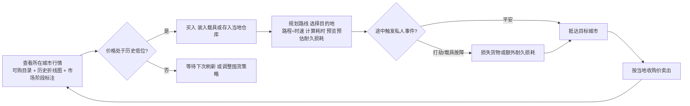
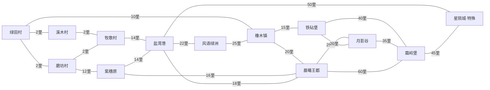
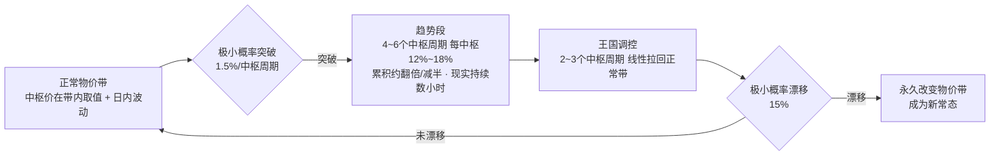

# 跑商网页游戏设计文档

> 版本：v8.25（存档覆盖根治）　|　日期：2026-08-13　|　状态：内测就绪
>
> 本版根治"存档仍被覆盖"。两个遗留漏洞：① `doLogin`/`doRegister` **无条件置 `GS.__loaded`**，绕过了 v8.24 的网络失败保护——登录时拉取存档失败也会上传初始档覆盖服务器；② 服务器并发保护用**客户端时间戳**比较，跨设备/时钟偏差会漏判，多标签页/多设备下旧状态可覆盖新状态。修复：① `__loaded` 仅在"已从存档加载"或"服务器明确确认无档"时置 true；② 并发保护升级为**版本号机制**（客户端携带已知服务器版本 `lastServerAt`，服务器拒绝旧版本提交，与时钟无关），并用真实服务器冒烟测试验证（同版本保存通过、旧版本提交被拒、存档未被覆盖）。

---

## 0. 修订记录

**v8.25（存档覆盖根治）**：

| 变化 | 说明 |
|------|------|
| `__loaded` 严格化 | `doLogin` 不再无条件置 `GS.__loaded`（由 `syncPlayer` 按服务器确认状态设置）；`doRegister` 仅在服务器明确确认无档时置 true |
| 版本号并发保护 | 服务器拒绝"客户端已知版本（`lastServerAt`）< 服务器当前版本"的提交，跨设备/时钟偏差不再误判或漏判 |
| 上传携带版本 | `autoSave`/`saveNow`/`pagehide`/`syncPlayer` 上传均携带 `lastServerAt`，保存成功更新已知版本，冲突时自动 `fullSync` 拉取 |
| 冒烟验证 | 真实服务器测试：首次保存通过、同版本保存通过、旧版本提交返回 conflict、服务器存档未被覆盖 |
| 版本同步 | 主版 `index.html` 与 `server.ps1` 同步更新 |

**v8.24（存档污染防护）**：

| 变化 | 说明 |
|------|------|
| 服务器账号忽略本机档 | `syncPlayer` 仅对离线注册账号（本机 users 列表）合并本机档，服务器账号一律以服务器为准——杜绝历史版本残留的"初始档+新时间戳"覆盖真实存档 |
| `__loaded` 加载标记 | `applySaved`/登录/注册后置 true；`autoSave`/`saveNow`/`pagehide` 在线分支未加载前不上传；`resetGameState` 清除 |
| 网络失败不置标记 | `GET /api/player` 失败（非服务器确认无档）时不置 `__loaded`，防止初始档被上传覆盖服务器 |
| 全新玩家正常建档 | 服务器明确确认无存档时置 `__loaded`，允许创建初始档 |
| 版本同步 | 主版更新（在线部署包已删除；单机版无服务器链路，不受影响） |

**v8.23（旅行点方向对齐）**：

| 变化 | 说明 |
|------|------|
| 方向对齐取点 | 新增 `ptOnRoad(a,b,segFrac,cityPos)`：判断曲线端点是否等于旅行起点，反向段用 `1-segFrac` 取点 |
| 路线完全正确 | 任何方向的旅行（含与 `ROADS` 定义相反的路段），点从出发城沿路网曲线到目的地，不再反向/乱跑 |
| 数值验证 | PowerShell 复现（oaktown→greentown 反向：修复前 progress=0 显示目的地、progress=1 显示出发地）并验证修复后全部正确 |
| 版本同步 | 主版 / 单机版一致更新 |

**v8.22（旅行位置跟随路网曲线）**：

| 变化 | 说明 |
|------|------|
| 曲线 key 归一化 | `roadCurve` 缓存 key 按端点排序，`ROADS` 顺序与 `shortestPath` 方向（可能相反）共用同一曲线 |
| 旅行点不再偏移 | 蓝色实时位置点严格沿画面上的路网曲线移动，跨城长途旅行（多弯道路段）不再偏离道路 |
| 无副作用 | `pointOnCurves` 按弧长取点、方向无关；路径标注（`cx/cy`）不受影响 |
| 版本同步 | 主版 / 单机版 / 部署包三份代码一致更新 |

**v8.21（车厢选择弹窗层级修复）**：

| 变化 | 说明 |
|------|------|
| 弹窗层级修复 | 新增 `backToWagonTypes(i)`：返回类型选择时先清空当前弹窗再打开类型面板，不再叠加 |
| UI 返回语义 | "返回类型选择"按钮真正回到上一层（类型列表），而非新开一层 |
| 版本同步 | 主版 / 单机版 / 部署包三份代码一致更新 |

**v8.20（存档加载门控 · 位置恢复）**：

| 变化 | 说明 |
|------|------|
| 存档加载门控 | 新增 `window.__gsReady`：`syncPlayer` 恢复存档、登录、注册后置 true；此前 `autoSave`/`saveNow`/`pagehide` 不保存，杜绝初始档覆盖真实进度 |
| 刷新/登录位置保持 | 玩家在哪保存，刷新/登入登出后 `syncPlayer` 恢复服务器（或本机）档，位置不再回到新手村 |
| 登出防串档 | `doLogout` 置 `__gsReady=false`，登出后的状态不会写入已登出账号 |
| 服务器不可用降级 | 在线账号在服务器不可用且非本机离线账号时不写本机档（boot 判断），本机离线账号允许本机保存 |
| 单机版刷新恢复 | 单机版 boot 自动恢复本机存档（此前刷新后不恢复且初始档覆盖存档），位置/进度持久 |
| 版本同步 | 主版 / 单机版 / 部署包三份代码一致更新 |

**v8.19（教程完成状态持久化）**：

| 变化 | 说明 |
|------|------|
| 离线保存带时间戳 | `saveNow`/`autoSave`/`pagehide` 离线分支统一写 `GS.__savedAt`，重连后能识别"本地较新→上传" |
| 存档合并统一 | 新增 `syncPlayer()`：服务器档 ↔ 本机离线档按时间戳取新恢复，本机新则上传；`fullSync`（刷新）与 `doLogin`（登录）共用 |
| 防假新档 | 服务器账号的离线保存不再写本机（`getUsers` 判断），避免刷新瞬间的初始档冒充"新档"覆盖服务器 |
| 教程渲染兜底 | `renderTutorial` 对 `step` 缺失/非数字一律视为已完成，不显示教程 |
| 新档时间戳清零 | `resetGameState` 置 `__savedAt=0`，防止旧时间戳导致合并误判 |
| 版本同步 | 主版 / 部署包一致更新；单机版仅补教程渲染兜底 |

**v8.18（世界时间锚点修复）**：

| 变化 | 说明 |
|------|------|
| 锚点不被覆盖 | `applySaved` 在线分支不再用存档反推值覆盖 `gameStartTime`，始终保留 `applyWorld` 设置的服务器 `worldStart` |
| 刷新即正确 | 刷新后世界天数/事件/价格锚点立即以服务器为准，无需登出再登录 |
| 离线不受影响 | 离线模式仍按存档 `gameStartTime`（无则反推）恢复，天数连续 |
| 版本同步 | 主版 / 单机版 / 部署包三份代码一致更新 |

**v8.17（事件全服一致性）**：

| 变化 | 说明 |
|------|------|
| 事件锚点时间轴化 | 新增 `getEventHubNow()`：当前中枢 = 距世界起始的游戏时 ÷ 中枢时长，与事件状态计算同源；不再依赖 `GS.day` |
| 全链路统一 | 事件触发、状态/倒计时、价格乘数（`getItemMult`/价差/维修）、事件横幅、情报生成全部基于同一时间轴 |
| 在线天数锚定 | 在线模式 `advanceDay` 强制 `GS.day` 与时间锚点对齐（离线仍可由 `/day` 调试） |
| `/day` 在线禁用 | 在线模式 `/day` 提示由世界锚点统一驱动，杜绝玩家改天数造成的事件错位 |
| 玩家一致性 | 同一服务器的玩家（共享 worldStart 与 timeScale）事件与价格完全一致 |
| 版本同步 | 主版 / 单机版 / 部署包三份代码一致更新 |

**v8.16（关键操作立即保存）**：

| 变化 | 说明 |
|------|------|
| `saveNow()` | 任务与引导的关键状态变更后立即保存（在线即时上传 / 离线同步写本地），不再等 400ms 防抖 |
| 接取/放弃/领取任务 | 三处操作后立即保存，刷新后已接任务不再消失 |
| 引导进度 | `advanceTutorial` 每推进一步立即保存，未完成引导时刷新不重置 |
| `pagehide` 兜底 | 页面关闭/刷新前最终保存一次：在线 `sendBeacon('/api/save')`（服务器已兼容），离线同步写本地 |
| 单机版不受影响 | 单机版 `autoSave` 本就同步写 localStorage，无防抖窗口，无需改动 |
| 版本同步 | 主版 / 部署包一致更新 |

**v8.15（刷新后自动恢复在线会话）**：

| 变化 | 说明 |
|------|------|
| 在线会话恢复 | 启动时若检测到已登录账号，自动 `startOnline()` 并 `fullSync()` 拉取服务器世界与玩家存档 |
| 排行榜修复 | `ONLINE` 恢复为 true 后排行榜走全服实时排名分支，刷新不再清空 |
| 附带收益 | 聊天室、自动存档、断线重连等在线逻辑刷新后同步恢复正常；任务板由 v8.14 兜底保证非空 |
| 单机版不受影响 | 单机版 `ONLINE` 恒为 false，排行榜读本机存档，刷新数据仍在 |
| 版本同步 | 主版 / 部署包一致更新（单机版无需改动） |

**v8.14（任务板空态修复）**：

| 变化 | 说明 |
|------|------|
| 任务板兜底 | 新增 `ensureTaskBoard()`：`render()` 前若任务板为空（注册/登录/存档迁移导致）则补足 5 个任务位 |
| 新手引导保通 | 新玩家注册登录后在新手村立即可见 5 个委托，引导第 2 步"接取任务"不再卡死 |
| 幂等安全 | 仅当任务板为空时补足；已接取的空位（state:'empty'）与刷新次数不受影响 |
| 版本同步 | 主版 / 单机版 / 部署包三份代码一致更新 |

**v8.13（地图缩放平移修复）**：

| 变化 | 说明 |
|------|------|
| 坐标系统一 | 新增 `mapUnitK()`：容器像素 → SVG viewBox 单位（850×520）换算系数 |
| 边界钳制修正 | `clampMap`/`centerOn`/`initMapView` 以 viewBox 为边界计算平移区间，最小缩放下全图完整可见、边缘城市可看全 |
| 缩放锚点修正 | `mapZoomAt` 鼠标位置换算为 SVG 单位后再计算锚点，滚轮/按钮缩放不再漂移 |
| 拖拽手感修正 | 拖动增量换算为 SVG 单位，地图与鼠标 1:1 跟随（此前放大倍率漂移） |
| 版本同步 | 主版 / 单机版 / 部署包三份代码一致更新 |

**v8.12（事件时间缩放 · 工程清理）**：

| 变化 | 说明 |
|------|------|
| 事件中枢随流速缩放（B2） | 新增 `getHubMs()`：事件时长 = 2h ÷ timeScale，GM 调速时事件与游戏日同步；预告/结束窗口仍按现实时间 |
| 主版静态快照清理（B4） | 移除旧地图（1050×580 旧坐标）与硬编码"王国限价令·进行中"；首屏显示"🗺 地图加载中…"占位，JS 启动后渲染真实地图 |
| 文案修正（B5） | 旅行提示与确认弹窗"耐久 -X%"改为"耐久 -X点"；同城倒卖注释"倒挂"改为"顺价套利"（语义修正） |
| 注释对齐（B5） | 声望升级公式、车厢位数量（Lv1=1、每级+1）注释与实现一致 |
| 死代码清理（B5） | 删除 `getMaxStock` 重复定义（唯一实现在库存上限处，含声望加成与顺价收紧） |
| 账号串档修复（D） | 登出调用 `resetGameState()` 重置为全新开局；离线新注册先重置再存新档，杜绝上一账号数据残留 |

**v8.11（声望交易化 · 任务与跑商并重）**：

| 变化 | 说明 |
|------|------|
| 声望-买入 | 每 10 件 +1 → **每 1 件 +1**（提升 10 倍） |
| 声望-卖出 | 每 5000 金 +1 → **每 1000 金 +1**（提升 5 倍） |
| 任务金币 | 每里报酬 50/200/600/2000 → **100/350/1000/3000**；按件附加 20/40/60/100 → **40/80/150/250** |
| 任务定位 | 从"材料+声望来源"调整为**与跑商并行**：新手村任务为启动资金主力，后期传说最高约 75 万金 |
| 事件叠乘 | **保持现状**（不设上限）：事件机遇的强度保留，频率由 freq 克制，强调"收集信息→抓住机遇" |
| 版本同步 | 主版 / 单机版 / 部署包三份代码一致更新 |

**v8.10（星陨城暂缓开放 · 收购事件修复）**：

| 变化 | 说明 |
|------|------|
| 星陨城暂不开放 | 地图节点置灰（`closed` 样式 + "（暂未开放）"标签）；`startTravel` 与地图点击双重拦截，无法前往 |
| 任务兜底防崩溃 | `rollTask` 送货分支对空货物城（`goods` 为空）自动改走送客分支，杜绝 `getItem(undefined).icon` 抛错 |
| 旧任务提示 | 目的地为星陨城的已接任务卡显示"目的地暂未开放"，玩家只能放弃任务 |
| 收购事件修复 | 偶遇行商 / 货主急购：按当前城卖出价 ×1.15 / ×1.30 全量买断，**扣除货物**并清理对应买入价与批次；结算仅含玩家自有货物（`GS.cargo`），任务物资天然不参与 |
| 离线世界持久化（B1） | `gameStartTime` / `BASE_PRICES` / `PURCHASE_LIMITS` 随存档保存并恢复；老存档按已存天数反推世界起始无缝衔接。离线世界**持续运行**——离线期间游戏日、物价、事件照常流逝；在线仍以服务器为准 |
| 车厢耐久倍率（C1） | `getWagonDurMulAll` 由"全部相乘"改为**加权求和**（`1+Σ(倍率−1)`，下限 0.2）：全货运 Lv5 车队 357× → 9×，全动力 0.0003× → 0.2×，混合车队合理；前期单节数值不变 |
| 版本同步 | 主版 / 单机版 / 部署包三份代码一致更新 |

**v8.9（事件系统扩充）**：

| 变化 | 说明 |
|------|------|
| 事件总量 14 → 42 | `EVENT_TABLE` 扩充至 42 条，价格注入/横幅/情报所/详情弹窗全部自动复用 |
| 全局物资事件 +8 | 针对铁锭/精钢刃、粗布/帆布、香料、食盐、药草/雪参、珠宝、灯油、麻绳的**全王国事件**，低频（0.04~0.06） |
| 城市整体事件 +6 | 铁砧堡/盐湾港/霜岭堡/风语绿洲/晨曦王都的**全城事件**，含价差调整（spread） |
| 城市单品事件 +14 | 覆盖月影谷/紫穗原/橡木镇/绿田村/溪木村/磨坊村/牧歌村/铁砧堡/盐湾港/霜岭堡的**产地行情**，是情报所价值核心 |
| 频率克制 | 新增事件 freq 多控制在 0.04~0.10，全局事件少量克制，城市事件仅在其所在城市或通过情报所才可见 |

**v8.8（地图铺满整个视口）**：

| 变化 | 说明 |
|------|------|
| 去除内层卡片边 | 移除 `mapFieldGrad` / `mapFieldLight` 两块带大圆角的不透明底板，不再出现“地图卡片套在 UI 卡片里”的边界 |
| 容器整块铺满 | `.map-wrap` 背景改为与地形一致的全幅渐变，地图底板由容器本身承担，边缘连续无接缝 |
| 等高线覆盖视口 | 等高线采样区 `ER` 保持比最小缩放可见范围更大，任何角落拖动都不露底 |
| 柔光/迷雾淡出 | `mapCoreLight` 与 `mistGrad` 均淡出到透明，避免出现硬边 |

**v8.7（地图外扩与环绕迷雾）**：

| 变化 | 说明 |
|------|------|
| 地图向外扩散 | `genMapDeco()` 将底图区域从原内层底板扩展为更大的 `mapFieldGrad` / `mapFieldLight` 地形场，地图不再像一块孤立地板 |
| 外围无城市地貌 | 城市外侧保留连续地貌背景，不额外放城市节点，让缩到最小时外围仍是自然延伸的地图环境 |
| 环绕迷雾 | 增加 `edgeMistGrad` 与四个大尺度迷雾椭圆，在地图四周形成柔和雾带，弱化“边界突兀感” |
| 边缘羽化再收敛 | `cityShields` 再次减弱，只保留轻微过渡，避免和外围迷雾争抢视觉焦点 |

**v8.6（地图层级简化）**：

| 变化 | 说明 |
|------|------|
| 底图层级简化 | `genMapDeco()` 从“大椭圆底光 + 四边遮罩”改成统一 `mapPlateGrad` 底板与轻微 `mapPlateLight` 内光，地图结构更清晰 |
| 边缘遮罩去杂化 | 移除四边独立渐隐矩形遮罩，避免底图层级显得割裂、压住地图本体 |
| 城市羽化收敛 | `cityShields` 仍保留，但半径与透明度下调，只对靠边城市做自然过渡，不再喧宾夺主 |

**v8.5（区域地貌与边缘羽化）**：

| 变化 | 说明 |
|------|------|
| 区域特征地貌 | `terrainHeightAt()` 增加四组区域性高度塑形：王都周边为宽缓低丘陵、霜岭堡北侧为高山脊、盐湾港为沿海缓坡、星陨城为裂谷/断层高差 |
| 更密更完整的背景 | 等值线采样步长由 `24` 降到 `18`，层级增至 `7` 层，填充阈值降低，背景覆盖更完整、更密集，不再显得稀薄 |
| 城市外侧羽化圆罩 | 渲染城市节点前新增 `cityShields`，对靠近地图边缘的城市加大羽化半径与透明度，让边缘城市外侧的圆形过渡更自然 |
| 地图边缘柔化 | `genMapDeco()` 新增四边渐隐层，边界不再是硬切，和等高线/城市节点的衔接更柔和 |

**v8.4（地图等高线全局适配）**：

| 变化 | 说明 |
|------|------|
| 全局高度场 | 新增 `pickTerrainPeaks()`，按城市距离与地图空间稀疏度挑选主峰，不再围着王都/边疆/特殊城直接画圈 |
| 统一等值线 | 新增 `terrainHeightAt()` + `contourEdgePoint()` + `stitchContourSegments()`，通过统一高度场提取多层等值线，线条会服从全地图的整体地形结构 |
| 城市周边缓坡 | 在高度场中对城市周边做轻微压低，形成更像现实聚落的缓坡/盆地，避免等高线直接压到城市节点上 |
| 纹理跟随地形 | 山体纹理短线改为沿主峰外圈切向分布，而不是全图随机撒点，视觉上更像真实山脊与坡面纹理 |

**v8.3（地图边界视口修复）**：

| 变化 | 说明 |
|------|------|
| 最小缩放边距 | `initMapView` 中 `MAP.sMin` 调整为原自适应缩放的 **90%**，给地图四周留出约 10% 观察边距；边缘城市在最小缩放时也能把整张地图收入视口 |
| 世界中心修复 | `clampMap` 不再假设地图从 `(0,0)` 开始，而是按 `((R.x1+R.x2)/2,(R.y1+R.y2)/2)` 计算**真实世界中心**，修复边缘城市时最小缩放回正后仍偏向一侧的问题 |
| 最小缩放仍可拖拽 | 当"视口大于地图"时，不再强制锁死到固定中心，而是围绕地图中心保留一小段 `slack` 平移余量，方便玩家继续查看地图四边与装饰区域 |

**v8.2（物价/库存与同城倒卖细化）**：

| 变化 | 说明 |
|------|------|
| 同城同次判定 | 货物批次 `GS.lots[gid]` 改为数组 `[{city,qty,cost,stamp}]`；`stamp=GS.visitStamp[city]`（本次停留批次号）。**只有"本次停留期间买入"的批次才受同城惩罚**；离开城市再返回（`visitStamp` 递增）后旧批次转为正常售价，模拟"带出去转一圈消除同城同次" |
| 售价低于出货价（倒挂）库存收紧 | 当 `买入价 < 卖出价` 时，`getMaxStock` 对该城该物资**临时减半**；价差过大（>10%）时进一步收紧到三成；`getCurStock` 同步钳制，避免显示/购买超上限 |
| 同城倒卖 60% 确认 | 同城同次倒卖且 `买入价<卖出价` 时，卖出前**弹窗提示**：若确认，该部分按**当前买入价 60%** 结算（正常情况仍为买入价 80%） |

**v8.1（数值与体验全面优化）**：

| 变化 | 说明 |
|------|------|
| 顶栏账号右对齐 | 玩家 ID 与登出按钮放入 `.t-right`（`margin-left:auto`），固定在顶栏右上角，不再跟在信息流后面 |
| 旅行路网不再抽动 | 根因：旅行中每秒整图重建导致路网/云雾动画被重启。现旅行中**仅增量更新位置点与进度**（`updateTravelUI`），不再重建 SVG |
| 定位按钮修复 | 缩到最小时视口大于地图，`centerOn` 被钳制导致"回到当前位置"看似失效；现 `mapCenter` **重置为默认缩放并居中** |
| 底部城市名修复 | 移除页面底部残留的静态"📍 当前：绿田村"占位节点（原位置在 `#app` 之外，从未随城市切换刷新）；当前城市改由地图信息栏/顶栏实时显示 |
| 售出面板两行 | 售出卡片由歧义的 `xxx → xxx` 改为 **成本：xxx / 当前售价：xxx** 两行；成本 = `GS.buyPrice`（该物资买入价加权平均） |
| 同城倒卖限制 | 新增货物批次 `GS.lots[gid][cityId]={qty,cost}`；**同城卖出按买入价 80% 结算**，异地卖出按正常售价；买入/卖出提示同城结算数量 |
| 任务付费刷新确认 | 前 2 次免费不变；第 3 次起弹出付费确认弹窗，含 **"今日不再提示"勾选**（按本地日期记忆） |
| 声望获得提示 | 买入/卖出 toast 增加 `⭐本城声望 +N`（N>0 时）；任务完成奖励声望原已显示；顶栏本城声望随城市实时刷新 |
| 等高线流光呼吸 | 等高线 stroke 加 `isoBreathe` 呼吸动画（透明度 + drop-shadow 光晕，按圈错相位），增强立体/流光感 |
| 情报消息最新置顶 | 情报所消息列表改为 **最新消息显示在最上方**；确认系统可产出事件类情报（`best`/`rare`），经 `markEventKnown` 写入 `knownEvents` 并出现在事件横幅 |
| 耐久公式重构 | `getDurabilityMax()` = 载具升级白值（`100+(lv-1)*20`）+ 核心强化耐久（`core.dura×50`）+ 所有车厢耐久（`hp`）；车厢卡/等级列表展示 `耐久+N`；维修/升级/装卸车均按新公式刷新 |
| 任务占用车厢锁定 | 接取任务后，为对应容量（货舱/旅客）提供容量的车厢**不可卸载/替换**（`isWagonLocked`），车厢卡显示"任务占用中"并禁用操作 |

**v8.0（账号门禁 · 体验优化）**：

| 变化 | 说明 |
|------|------|
| 账号门禁 | 页面加载时若无登录账号，全屏注册/登录遮罩弹出（不可跳过）；**未登录不能玩**；顶栏右上角显示 **👤 玩家 ID + 登出按钮**（`doLogout` 清除会话回到登录界面，数据保留在服务器） |
| 旅行中城市页闪烁修复 | 根因：旅行中每 2 秒重建内容区（市场卡片/图表重绘）。现**仅地图页签每秒刷新**（旅行位置点动画），其他页签不重建；抵达时 `advanceDay` 返回 arrived 自动全量渲染 |
| 地图最小缩放拖拽 | 根因：视口大于地图时 `clampMap` 强制居中锁死。现保留 **±35% 视口容差**，缩到最小时仍可拖拽平移 |
| 旅行坐标弧长对齐 | 旅行位置点从"段内线性比例"升级为**贝塞尔弧长均匀分布**（`bezierLen` 24 段折线近似 + 弧长定位），沿弯曲路网**匀速**行进，与渲染曲线完全一致（实测 50% 位置精确匹配） |

**v7.9.1（数值系统全面审计）**：

| 修复 | 说明 |
|------|------|
| 车厢容量计算 | 确认货舱/旅客容量 = **所有已装配车厢之和**（`getVehicleCapacity`/`getPassCapacity`），任务占用独立核算（货舱 `getTaskCargoUsed` / 旅客 `getTaskPassUsed`）；`getWagons()` 限定有效车厢位（`slice(0,slots)`），修复超槽位旧存档导致"容量与 UI 显示不一致" |
| 换车厢/卸车超载保护 | `buyWagon`（免费装配/购买）与 `unloadWagon` 装配前用 `fitAfterSlot` 预测容量：现有货物+任务货 / 旅客+任务旅客超出新容量时**阻止并提示**（先转移/卖出/完成任务）；GM `/wagon` 指令同样校验 |
| 老存档兼容 | `applySaved` 对无 `wagons`/无 `core` 的旧存档补默认装配（均衡 Lv1），防止容量为 0 无法交易 |
| 世界参数对齐 | `applyWorld` 在 perPlayer 库存模式下按服务器限购补齐客户端库存结构缺失项（不覆盖玩家已消耗库存），消除"限购已更新但库存未对齐"的潜在不一致 |
| 传输一致性验证 | 买卖/任务/车厢变更 → 自动保存（400ms 防抖）→ 服务器存档 → 重载完全一致（实测 gold/cargo 精确往返） |

**v7.9（交互式地图）**：

| 变化 | 说明 |
|------|------|
| 两个当前城市修复 | 地图信息栏（📍 当前）从地图容器内移出（`map-info` 置于地图下方，不再 absolute 覆盖），地图上仅保留当前城市节点高亮（唯一 `current`） |
| 缩放 / 平移 | SVG `g transform` 视口方案：滚轮以鼠标位置为中心缩放（缩放范围自适应世界/4 倍）；**拖拽改用 Pointer Events**（鼠标/触屏/触控笔通用，拖拽光标 grab/grabbing），与城市节点点击智能区分；右上角 ＋/－/⌖ 按钮；视口边界钳制不飞出地图 |
| 当前城市居中 | 首次进入地图自动以当前城市为中心（挂载后按真实容器尺寸校正）；旅行中 ⌖ 可随时回到当前位置 |
| 等高线地形 | 确定性伪随机（seed 20260812）生成围绕王都/边陲/星陨城的 3~4 圈等高线闭合曲线（20 采样点 + 噪声扭曲）；**叠加地形填充层**（逐圈加深绿色，山峰感明显）+ 26 条随机纹理短线（山脉走向） |
| 曲线路网 | 道路按**里数分段三次贝塞尔**（≤9 里 1 段、10~22 里 2 段、>22 里 3 段；短途近似直路，**长途/边缘路大弧度弯道**，振幅 0.10~0.34 随里数增大）；叠加流动虚线"商路"动画层（3s dashoffset 循环）；曲线参数缓存（`MAP_CURVES`） |
| 旅行位置跟随路网 | 旅行中的蓝色位置点不再直线穿行，而是**沿曲线路径插值**（`pointOnCurves` 按贝塞尔段定位 + 三次贝塞尔求点），与渲染路网完全一致 |
| 流动云雾 | 9 朵半透明云（ellipse）置于最上层，**feGaussianBlur 高斯模糊**成柔和云团 + CSS 呼吸透明度动画 + `animateTransform` 慢速循环平移（45~85s），不拦截任何交互（pointer-events:none） |

**v7.8（断线重连 · 并发优化）**：

| 变化 | 说明 |
|------|------|
| 网络状态机 | 顶栏新增 ⚡ 状态点：🟢 在线 / 🔴 断开重连中 / ⚪ 离线模式；请求失败自动标记断线并启动重连（10 秒间隔 ping `/api/world`） |
| 断线恢复全量同步 | `fullSync()`：恢复后拉取最新世界（timeScale/广播）+ 玩家存档；按存档时间戳决定"拉取覆盖"还是"上传本地"（服务器较新→覆盖，本地较新→上传），随后对齐游戏日 |
| 自动存档优化 | 400ms 防抖合并连续渲染的保存请求（`__saveSeq` 序号丢弃过期请求），大幅减少请求量 |
| 多端并发冲突 | 服务器 `POST /api/save` 比较 `clientSaveTime` 与存档 `__savedAt`：客户端时间戳较旧（另一设备已保存）→ 返回 `{conflict:true}` 拒绝覆盖；客户端收到后自动 `fullSync` 拉取服务器最新存档并 toast 提示"检测到其他设备登录" |
| 时间戳基准 | 存档 `__savedAt` 以客户端提交时间为基准（同设备连续保存自然递增，避免时钟偏差误判）；旧存档无时间戳时首存不冲突（平滑升级） |

**v7.7（聊天面板交互优化 · 事件图鉴隐藏）**：

| 变化 | 说明 |
|------|------|
| 聊天对话框展开方式 | 点击 💬 气泡 → 对话框**从气泡位置原地展开**（气泡隐藏），不再是固定悬浮面板 |
| 对话框拖动 | 拖动**标题栏**可随意移动对话框（复用通用 `makeDraggable`） |
| 关闭还原 | 点 ✕ 关闭 → 对话框隐藏，**重新变回 💬 气泡**，气泡出现在对话框最后所在位置 |
| 事件图鉴入口 | 事件横幅不再渲染"📖 事件图鉴"入口（`showEventCatalog` 等函数保留，后续版本开放） |
| 情报所占位符 | 移除"后续版本：任务发布 · 任务提交 · 声望系统"占位提示（情报所功能已实现） |
| 视图显隐修复 | 修复新增页签 `#view-achrank` 未纳入 CSS 显隐规则导致的"成就排行出现在其他页签下方"问题（各页签互不重叠） |

**v7.6（弹幕聊天室）**：

| 变化 | 说明 |
|------|------|
| 弹幕聊天室 | 左下角 **💬 可拖动气泡**（点击=展开面板 / 拖动=换位置，不与指令台冲突）；输入框 + 发送（Enter）；"查看历史"展开完整消息列表 |
| 消息格式 | 弹幕与历史均显示 **`【玩家id】〈所在地〉：内容`**（所在地 = 发言时所在城市名） |
| 弹幕效果 | 网页**顶部 25% 区域内随机高度**（`#danmaku-layer`），从右向左飘过（`translateX(100vw→-100%)`，8~14 秒随机时长），飘出左缘自动移除 |
| 历史消息 | 每条带现实时间 **HH:MM:SS** 时间戳；在线以服务器为准（首拉全量历史不弹幕，之后增量弹幕），离线存 localStorage（按账号隔离，保留最近 200 条） |
| 服务器 | `POST /api/chat`（{user,loc,msg}，上限 200 字，存入 `chat.json`）；`GET /api/chat?since=<id>` 增量拉取；聊天记录保留最近 200 条；客户端 3 秒轮询同步（登录后立即发言会自动先补拉历史） |
| 单机版 | 同步聊天室（无服务器，本地聊天 + 弹幕 + 历史持久化） |

**v7.5（成就系统 · 排行榜）**：

| 变化 | 说明 |
|------|------|
| 成就系统 | 16 项成就（首单任务/累计收入/卖出件数/旅行里程/拜访全城/金币里程碑/车厢/核心/声望等），自动检测解锁 + toast 提示 + 金币/材料奖励；成就面板含总进度条 + 卡片（图标/描述/奖励/进度%） |
| 排行榜 | **与成就合并为单页签 `🏆📊 成就排行`**（排行榜在上、成就在下），四榜切换：💰金币 / 🛣️里程 / 📜任务 / ⭐声望；**在线版**全服实时排名（服务器 `GET /api/rankings` 读取 `players/` 计算，含"（我）"标记）；**单机版**本机多账号排名（localStorage） |
| 数据统计 | `GS.stats`（bought/sold/tasks/travels/distance/visits/income/upgrades/reps）自动埋点（买卖/出行/抵达/任务完成/车厢与核心升级/声望升级），`GS.achievements`/`GS.visitedCities` 存档，`applySaved` 兼容旧存档 |
| 服务器 | v4 新增 `GET /api/rankings?type=gold\|distance\|tasks\|rep`，Top 20 |
| 单机版 | 同步成就系统 + 本机多账号排行榜 |

**v7.4（30 分钟库存刷新 · GM 后台指令 · 在线部署包）**：

| 变化 | 说明 |
|------|------|
| 库存刷新（正式） | **每现实 30 分钟**补满一次（原"随游戏日刷新"→ 文档 §4 正式值 30 分钟；每人库存仍独立、全服同时刷新；客户端 `STOCK_REFILL_MS=1800000`、服务器 `MaybeRefill` 同步） |
| 后台指令系统 | 游戏内右下角 **🛠 指令台**（或控制台 `runCmd()`）。**本地指令**（无需密码）：`/addgold /addcargo /addmat /repair /core /wagon /setrep /stock /day /gold /help`；**GM 指令**（`/gm <密码> …`，服务器执行，需世界管理密码）：`timescale`（世界时间流速 0.1~100，全服生效）、`setday`、`givegold`、`giveitem`、`broadcast` |
| GM 密码 | 服务器首次启动自动生成并打印（**ADMIN PASS**），存于 `world.json.adminPass`，可自行修改 |
| timeScale 世界流速 | `world.json.timeScale`（默认 1）：游戏日实际时长 = 10 分钟 ÷ 倍率；客户端轮询同步 + 在线玩家自动提示 |
| 在线部署包 | 新建 `在线部署包/` 文件夹：index.html + server.ps1 + start-server.bat + setup-admin.ps1 + default-world.json + 部署上线指南.txt + README，可直接分发开服 |
| 单机版 | 同步 30 分钟刷新与本地指令（无 GM 服务器指令） |

**v7.3（正式时间配置 · 部署文档）**：切换为文档正式时间设定——

| 配置项 | 演示值（旧） | 正式值（新） |
|--------|------------|------------|
| 游戏日 | 10 秒（`/10000`） | **10 分钟**（`/600000`，`getCurrentGameDay` 与服务器 `GetWorldDay` 同步） |
| 中枢周期 | 60 游戏日 = 10 分钟 | **12 游戏日 = 2 现实小时**（`CENTRAL_PERIOD=12`、`HUB_MS=7200000`） |
| 事件预告/结束窗口 | 5 分钟 / 2 分钟 | 5 分钟 / 2 分钟（不变，符合文档 §8 状态判定） |
| 库存刷新 | 30 秒定时（`STOCK_REFILL_MS` 已删除） | **随游戏日刷新**（10 分钟/日） |
| 部署文档 | 无 | 新增《部署上线指南.txt》（局域网 + 互联网联机） |

实测：价格引擎按新中枢计算正常、事件系统正常、在线注册后客户端/服务器游戏日一致（day=2）。

**v7.2（服务器自动运行世界 · 库存独立 · 单机版）**：

| 变化 | 说明 |
|------|------|
| 单机版 | 新建 `单机版/` 文件夹（index.html + README），**剥离全部在线代码**，本地注册/登录，存档存浏览器 localStorage |
| 服务器自动运行世界 | `server.ps1` v3 启动时自动从 `default-world.json` 建 `world.json`（`worldStart`=启动时刻）；`default-world.json` 为随包附带的 13 城价格种子/购买限额（由游戏引擎生成） |
| 库存独立 | **每人库存独立不共享**（库存存在各自存档 `gs.cityStocks`）；随**服务器游戏日**（10 秒/日）**同时刷新**至购买限额 |
| stockMode 接口 | `world.json` 中 `stockMode: "perPlayer"`（默认）；未来改 `"shared"` 即启用全服共享库存池（`/api/trade`、`/api/stocks` 已按模式分流） |
| 客户端 | `refillStocks` 改为**按游戏日刷新**（非 30 秒定时）；移除共享库存轮询；`applySaved` 补全 `cityStocks`/`lastRefillDay`（修复登录不恢复库存） |

**v7.1（共享世界 · 多人内测）**：上线**共享世界服务器**（`server.ps1` v2，.NET HttpListener 零依赖）：

| 端 | 内容 |
|----|------|
| 世界共享 | 首个玩家创建世界（价格种子/购买限额/世界起始时间/初始库存 → `world.json`），后续玩家自动同步 → **所有玩家价格/天数/公共事件一致** |
| 库存权威 | `POST /api/trade` 服务器记账（买入减/卖出加），30 秒补货，玩家 30 秒轮询同步 |
| 账号服务 | `POST /api/register` `/api/login`（SHA256+salt 密码）、`GET /api/player/{user}`、`POST /api/save`（存档在 `players/{user}.json`） |
| 客户端 | `startOnline()` 检测服务器→加载共享世界；`autoSave` 在线存服务器/离线存 localStorage；**file:// 单机回退**仍可玩 |
| 内测指南 | 见文末"多人内测接入指南" |

**v7.0（用户注册/登录 · 内测就绪）**：新增**用户注册与登录认证覆盖层**——页面加载时弹出认证面板，支持**注册新账号**（用户名 3~12 字符 + 密码 4 位以上）与**登录已有账号**（密码匹配校验）；注册后自动保存初始游戏状态（localStorage），登录后恢复完整存档；每次渲染自动存档；支持登出回认证面板；**原有游戏代码零改动**。本版为项目首个可内测版本。

**v6.15.1（修复）**：修复导航栏按钮中文乱码（🗺 地图 / 🏙 城市 / 🚛🏪 载具仓库）——v6.15 重建 body 骨架时 PowerShell 以系统编码读入 .ps1 源码导致 mojibake，已用 UTF-8 正确文本修复并全 DOM 扫描确认无残留乱码。

**v6.15（仓库分级解锁 + 指数扩建）**：初始**无仓库**；花金币按城市阶段分级解锁——新手村 500 / 中期 5000 / 高级 50000，初始 **100 格**；扩建 +50 格/次，费用**指数增长** `解锁价×系数^次数`（新手村 ×1.5、中期 ×2~2.5、高级 ×3，越后期越贵）；新手村与特殊城市**可**解锁（原"不可购买"取消）。同时修复浏览器检查工具再次写入的 body DOM 污染（重建页面骨架）。

**v6.14（新手引导）**：新增 5 步新手引导（内容区顶部面板）：**买基础物资 → 接任务 → 前往任务目的地 → 完成任务 → 卖物资**；每步带操作说明、跳转按钮（切到对应页签）与步骤进度条，**顺序推进**（乱序操作不跳过），可"跳过教程"；完成后面板隐藏。注：项目为**联网多人架构**，本地存档不做（存档由服务器承担）。

**v6.13**：初始车厢由货运 Lv1 改为**均衡车厢 Lv1**（货舱 30 + 旅客 4、损耗 ×1.1）——新手期即可兼顾送货与送客任务，兼顾"两者兼顾"的引导。

**v6.12（车厢独立解锁制）**：车厢改为**每节独立解锁**——每个车厢位拥有自己的已购车厢集合（`{cur, owned}`）；**未购买的车厢需花金币解锁**（首次购买），**已购买过的车厢可免费更换装配**（同节车厢位内任意切换，不再重复扣钱）；**各车厢位解锁进度互不影响**。卸载仅解除装配（解锁进度保留，可免费重新装配）；载具必须保留至少 1 个已装配车厢。选择流程中已解锁项标记"✔ 免费装配/已解锁"，未解锁显示"X 金解锁"。

**v6.11（UI 修复）**：**车厢选择弹窗按钮化**——类型选项改为大卡片按钮（类型色边框、图标、能力概览、箭头、hover 上浮高亮），等级选项改为带 **Lv 徽章 + 金色价格**的按钮（hover 右移高亮），返回按钮一并按钮化；已装车厢卡不再整卡可点（仅空位卡可点）。同时清理浏览器检查工具误写入 index.html 的 DOM 残留（含旧版弹窗）。

**v6.10 相对 v6.9 的变更**

| 模块 | v6.9 设计 | v6.10 新设计 |
|------|-----------|-------------|
| 车厢费用-1级 | 4000 | **几万（货运 3 万）** |
| 车厢费用-2级 | 1.5 万 | 9 万 |
| 车厢费用-3级 | 5 万 | 24 万 |
| 车厢费用-4级 | 20 万 | **大几十万（60 万）** |
| 车厢费用-5级 | 100 万 | **小几百万（180 万；动力 360 万）** |
| 费用分布 | 前平后陡 | **指数分布** `base×[1,3,8,20,60]`（货运/载客 base 3万、均衡 4.5万、动力 6万） |
| 选择按钮 | 更换/＋ 按钮灰底 | **accent 高亮**：空位带"＋ 添加车厢"按钮（虚线高亮+hover 上浮）、已装车厢"🔁 更换车厢" |
| 核心按钮 | "⚡ 强化核心（材料）" | **"⚡ 强化核心"**（材料需求点入弹窗查看） |

**v6.9 相对 v6.8 的变更**

| 模块 | v6.8 设计 | v6.9 新设计 |
|------|-----------|-------------|
| 车厢位 | Lv1=2、每 2 级 +1（Lv9+=6） | **= 载具等级**：Lv1=1 → Lv10=10（一级一个车厢即可，满级 10 节） |
| 货运车厢 | 速度不变 | **降速 ×0.95**；损耗梯度 1.2→1.8 |
| 载客车厢 | 速度不变 | **略提速 ×1.05**；损耗梯度 1.2→1.8 |
| 均衡车厢 | 损耗 ×1.25 固定 | **略降速 ×0.97 + 损耗梯度 1.1→1.58** |
| 动力车厢 | 提速+降耗 | 不变（×1.1~1.6 / ×0.45~0.85） |
| 损耗梯度 | 非动力固定 | **随等级梯度增加**（容量越大损耗越高） |
| 费用梯度 | base×3^(lv-1)（5级 32.4万） | **base×[1,3.75,12.5,50,250]**：1级 4000 → 5级 **100万**（动力 300万），获取越来越难 |
| 更换流程 | 单层列表 | **两级选择**：先选类型 → 再选等级（可返回） |
| 车厢 slot | 右上角更换 🔁 | **右上角卸载 ⬇**（载具必须保留至少 1 个车厢）+ 下方更换按钮 |
| 载具核心 | — | **面板最前新增核心 slot**：提交不同数量特殊道具升级——⚡疾驰（速度+1：燃油舱+引擎核心×N）、🛡强化（耐久+50：维修套件+引擎核心×N），N 随次数递增 |

**v6.8 相对 v6.7 的变更**

| 模块 | v6.7 设计 | v6.8 新设计 |
|------|-----------|-------------|
| 车辆容量 | 等级直接决定货舱/旅客仓 | **由车厢决定**（`getVehicleCapacity/getPassCapacity` 汇总车厢容量） |
| 车辆速度 | 固定（升级+2） | **动力车厢提供速度倍率**（Lv1~5：×1.1/1.2/1.3/1.45/1.6，可叠加） |
| 耐久损耗 | 固定阶段倍率 | **×车厢耐久倍率**：货运/载客 ×1.35、均衡 ×1.25（掉更快）；动力 ×0.45~0.85（掉更慢） |
| 载具升级 | 货舱+50/旅客+5/时速+2/耐久+20 | **只加车厢位 +1（每2级）与耐久+20**；金币+素材机制不变 |
| 车厢位 | — | **Lv1=2、每 2 级 +1（Lv9+=6）**；空位显示加号 |
| 车厢类型 | — | **货运📦/载客🧳/均衡⚖️/动力⚙️**，各 5 级（货运货舱 60~450、载客旅客 8~25、均衡 30~220+4~12、动力提速+降耗） |
| 购买/替换 | — | 每节车厢**单独购买/替换**（价格 base×3^(lv-1)，货运 4000→动力 12000 起步） |
| 页面布局 | 车站在城市页签 | **车站面板移至载具仓库页顶部**（载具栏/仓库栏在下方）；城市页签仅市场/情报所/任务板 |

**v6.7 相对 v6.6 的变更**

| 模块 | v6.6 设计 | v6.7 新设计 |
|------|-----------|-------------|
| 王都初始库存 | 基础 250~400 · 特产 60~100 | **基础 120~200 · 特产 50~80**（初始仅一两百） |
| 特殊城市初始库存 | 基础 200~350 · 特产 50~80 | **基础 100~180 · 特产 40~70** |
| 库存上限极限 | 声望加成无感知上限 | **300~500 为当前大版本极限**（基础 120~200 ×(1+15%/级)，Lv10 达 300~500、Lv15 约 500 封顶） |
| 清空难度 | 中后期可轻松清空 | **慢速清空**：需高声望解锁更大库存上限 + 多趟往返 |

**v6.6 相对 v6.5 的变更**

| 模块 | v6.5 设计 | v6.6 新设计 |
|------|-----------|-------------|
| 城市梯度 | 仅 tier 区分 | **四段发育梯度** `cityStage`：新手村(1)/初期(2)/中期(3)/后期(4) |
| 任务目的地 | 任意城市 | **仅同阶段+下一阶段**（新手村→近邻初期城市，不出长距离） |
| 任务稀有度 | 全阶段按声望 | **按梯度封顶**：新手村仅普通/稀有（72/28）、初期无传说（60/30/10）、中期传说 3%、后期全开放 |
| 任务金币单价 | 统一 2000 金/里 | **按阶段**：新手村 50 / 初期 200 / 中期 600 / 后期 2000 金/里（按件附加 20/40/60/100，送客×5） |
| 新手村任务奖励 | 几千~几万 | **几百~一千起步**（实测 200~2800，无史诗/传说、无远距） |
| 初始库存 | 随机范围 | **全部整十**（`r10`，如 50/60/70/80、120~200、30~50），方便计算声望加成上限 |

**各阶段任务奖励实测梯度**：新手村 200~2800 → 初期 2200~20800 → 中期 1.35万~12.57万 → 后期 3.25万~38.5万（传说）。

**v6.5 相对 v6.4 的变更**

| 模块 | v6.4 设计 | v6.5 新设计 |
|------|-----------|-------------|
| 特产价格 | 中档几百~两千、高档几千 | **中档 2000~8000（大几千）· 高档 1.2万~3.6万（万级）**（如珍珠 1.2万/1.8万、月光水晶 1.8万/2.6万、猛犸牙 2.6万/3.6万） |
| 初始货舱 | 200 格 | **60 格**（升级每级 +50，Lv10=510，一车可带 500+） |
| 一车流水 | 万级 | **百万级**（500 珍珠 × 1.8万 ≈ 900 万流水；跑商利润一车数十万~数百万） |
| 任务金币 | 基础 120~240+按件 | **按路程距离×2000×稀有度**：短距 1万~6万、中距 6万~12万、长距 14万~36万（传说百万） |
| 玩家流动金币 | 十万级 | **百万~千万~亿**（后期） |
| 升级花费 | 500+400×lv | **4000×lv²**（Lv1→2 4000 / Lv5→6 10万 / Lv9→10 32.4万） |
| 声望阈值 | 300/800/1500 起 | **×10**：3000/8000/15000 起（长期养成，town Lv8 约百万） |
| 任务声望 | 25/60/150/300 | **250/600/1500/3000** |
| 仓库购买 | 2000 金 | **20000 金** |
| 情报解锁/消息 | 5000/1000 金 | **50000/10000 金** |
| 维修费用 | 6 金/点 | **60 金/点** |

**v6.4 相对 v6.3 的变更**

| 模块 | v6.3 设计 | v6.4 新设计 |
|------|-----------|-------------|
| 初始库存-新手村 | 全部 350（太多，短时间搬不空） | **基础 50~80**（快速搬空，中期收益小，引导转城镇） |
| 初始库存-城镇 | 基础 250~400 | **基础 120~200 · 中档特产 60~120 · 高档特产 25~50** |
| 初始库存-王都 | 基础 250~400 | **基础 250~400 · 特产 60~100**（后期大批量进货地） |
| 初始库存-特殊城 | — | 基础 200~350 · 特产 50~80 |
| 任务金币-基础 | 80~160 | **120~240**（按稀有度倍率） |
| 任务金币-送货 | 8 金/件 | **25 金/件**（与跑商顺路收益相当） |
| 任务金币-送客 | 60 金/人 | 60 金/人（保持，大团收益高） |

**v6.3 相对 v6.2 的变更**

| 模块 | v6.2 设计 | v6.3 新设计 |
|------|-----------|-------------|
| 送客人数 | 固定 1~3 人 | **按稀有度**：普通 1~3 / 稀有 4~8 / 史诗 10~25 / 传说 30~60 |
| 城市等级放大 | 无 | **王都 ×2、特殊城市 ×1.5**（`getCityTierMul`），王都传说可达 60~120 人（百人团） |
| 城市稀有度 | 仅声望驱动 | **王都基础稀有度 +1 级**（更高级的城市有更高级的任务） |
| 大团接取 | — | 容量不足自动拒绝（提示"旅客仓空间不足"），需升级载具旅客仓 |

**v6.2.1（小修复）**：任务货物占用的货舱容量同步到**载具仓库面板**与**市场买卖卡片**的容量显示（此前仅 topbar 同步）；载具面板新增"📦 任务货物占用 X 格"提示（完成/放弃后释放，不可转入仓库）。

**v6.2 相对 v6.1 的变更**

| 模块 | v6.1 设计 | v6.2 新设计 |
|------|-----------|-------------|
| 送货任务货物 | 需玩家备齐货物（载具+仓库） | **任务自带任务货物**：接取即占货舱 qty 格，无需备货；描述可显示实际物资，接取后统一"任务货物" |
| 送客人数 | 固定 1 人 | **多人 1~3 人**，占旅客仓 qty 格（`capType:'pass', qty`） |
| 任务数量 | 单任务（active 单对象） | **多任务**：`GS.tasks.active` 改为数组，容量允许可接多个 |
| 接取后任务位 | 从列表移除 | **不消失**：清空内容，居中显示【查看更多任务】按钮，刷新计次继承（计入免费2次/付费翻倍） |
| 任务板结构 | board=任务数组 | **board=5 个 slot**：`{id, state:'task'\|'empty', t, refreshCount}` |
| 任务货物归属 | 玩家 cargo | **任务内管理**，不可转移仓库；完成/放弃后释放容量 |
| 容量占用 | 送客占用旅客仓 | 送货占货舱 qty、送客占旅客仓 qty（`getTaskCargoUsed/getTaskPassUsed`），topbar 容量实时体现 |

**v6.1 相对 v6.0 的变更**

| 模块 | v6.0 设计 | v6.1 新设计 |
|------|-----------|-------------|
| 任务稀有度 | 固定权重（50/30/15/5） | **与本地声望挂钩**（`RARITY_TABLE`：Lv0 72/25/3/0 → Lv4+ 42/34/19/5），高稀有度总体低频 |
| 素材奖励 | 任何任务 35% 概率 | **仅稀有 20% / 史诗 45% / 传说 80% 概率**，普通任务不产出；素材类型多样化（齿轮/套件/燃油舱/引擎核心） |
| 任务板布局 | 单层卡片 + 上方已接 | **上下两排 + 分隔线**：上层=已接任务（无任务也保留占位高度）、下层=城市内可接任务（**固定宽度卡片不自适应**，超出横向滑动） |
| 不可接原因 | 按钮置灰无说明 | **按钮显示原因**：送货"需备货 X/Y"、送客"旅客仓已满" |
| 声望-升级阈值 | 300+250×等级（线性） | **按城市等级指数增长**：`tierBase×2^等级`（village 300 / town 800 / capital 1500 起，Lv7+ 达数万、Lv8+ 十万级） |
| 声望-买入 | 每件 +1 | **每 10 件 +1** |
| 声望-卖出 | 每 1000 金 +1 | **每 5000 金 +1**（×0.02%） |
| 声望-任务 | 按稀有度 ×15 倍率 | **梯度提升**：普通 25 / 稀有 60 / 史诗 150 / 传说 300（任务成为主要来源） |

**v6.0 相对 v5.9 的变更**

| 模块 | v5.9 设计 | v6.0 新设计 |
|------|-----------|-------------|
| 任务数量 | 每城 3 个 | **每城 5 个**（`genTasks` 5 次 `rollTask`） |
| 任务稀有度 | 无 | **普通50%/稀有30%/史诗15%/传说5%**，奖励倍率递增，卡片边框/标签着色 |
| 任务刷新 | 无 | **每任务每城免费 2 次；第 3 次起 1000 金，逐次翻倍**（1000/2000/4000...） |
| 任务板布局 | 单层列表 | **上层=已接任务（放弃叉叉+领取奖励），下层=可接任务卡片一字排开** |
| 放弃任务 | 无 | **确认弹窗 → 释放旅客仓**（送客） |
| 抵达完成 | 手动交付（货物扣除在交付时） | **抵达目的地自动释放容量**（送客下车/送货交付），随后按钮领取奖励 |
| 接取限制 | 送客查货舱 | **送客查旅客仓**（`getPassFree`）；旅客仓不足不可接取 |
| 车辆容量 | 单一货舱 | **货舱 + 旅客仓独立**（初始旅客仓 10 格，1 旅客占 1 格） |
| 载具升级 | 货舱 +50/时速 +2/耐久 +20 | + **旅客仓 +5** |
| 声望-买入 | 按金额（每200金+1） | **按数量**（每件 +1） |
| 声望-卖出 | 按金额 | **按税收折算**（售价 ×0.1%，约每1000金+1） |
| 声望升级 | 200+150×等级 | **300+250×等级（更慢，长期养成）** |
| 声望解锁 | 跨城货源（REP_GOODS 跨城物资） | **仅本城特产逐步解锁**（删除跨城货源概念） |

**v5.9 相对 v5.8 的变更**

| 模块 | v5.8 设计 | v5.9 新设计 |
|------|-----------|-------------|
| 任务系统 | 预留（6.5 未实现） | **实装**：每城任务板（3 个随机任务，抵达城市刷新）；送货/送客；交付奖励金币 + 发布城声望 + 素材 |
| 升级素材道具 | 无 | **新增**：`MATERIALS`（精密齿轮/维修套件/燃油舱/引擎核心），`GS.materials`，任务产出，用于载具升级 |
| 城市声望 | 情报所联动公式就绪，无获取途径 | **实装**：`GS.reputation:{cityId:{level,exp}}`；获取=本城交易额（每200金1点）+完成任务；效果=解锁物资/限购+15%/级/卖出价+1%/级 |
| 载具升级 | 占位（6.4 未开放） | **实装**：金币+素材升级（Lv1 需 500金+⚙️1），容量+50/时速+2/耐久+20 |
| 界面 | — | 城市视图新增**任务板**区块；topbar 显示**本城声望 Lv**；车站升级卡实装 |
| 存档 | 无 | **确认不做**（联网架构下由服务器接管） |

**v5.8 相对 v5.7 的变更**

| 模块 | v5.7 设计 | v5.8 新设计 |
|------|-----------|-------------|
| 解锁范围 | 全局一次性（任何城市可用） | **每城独立解锁**：`GS.intel.unlocked:{cityId:true}`，换城需重新解锁，回城仍有效 |
| 声望作用域 | 预留（未接入） | **按城市独立计算**：`getRepLevel(cityId)` 驱动 range（每3级+1）、pBest/pRare、消息条数（每5级+1） |
| 信息栏 | 本城临时记录，抵达新城市清空 | **不变**（log 仍城市独立、抵达清空） |
| 事件记录 | 跨城市保留至过期 | **不变** |

**v5.7 相对 v5.6 的变更**

| 模块 | v5.6 设计 | v5.7 新设计 |
|------|-----------|-------------|
| 信息栏（log） | 全局共享，跨城市保留 | **按城市独立，抵达新城市即清空**（仅保留"已抵达"提示） |
| 解锁状态 | 全局永久 | **不变**（一次性 5000 金，全局永久） |
| 事件记录 | 获得事件情报标记 knownEvents，跨城市保留至过期 | **不变**（事件记录仍跨城保留，仅聊天信息栏清空） |
| log 语义 | 全局聊天记录 | **本城临时记录**（`GS.intel.log`，离开城市后清空） |

**v5.6 相对 v5.5 的变更**

| 模块 | v5.5 设计 | v5.6 新设计 |
|------|-----------|-------------|
| 解锁方式 | 5000 金门票，当前城市停留期间有效 | **5000 金一次性永久解锁**（同仓库机制，跨城市保留） |
| 信息获取 | 购买后全量展示周边事件卡片 + 预告区块 | **酒馆打听消息 1000 金/条**，聊天式气泡返回 |
| 消息类型 | — | 预告事件（最佳 18%）/ 附近进行中事件（稀有 32%）/ 物价行情（一般 50%） |
| 物价情报 | — | **实际物价驱动 + 20 条聊天文案模板**（`INTEL_TEMPLATES`，占位符套数据） |
| 事件获得 | 门票标记周边全部事件 | **获得事件情报时 `markEventKnown` 直接记录到事件列表** |
| 数据模型 | `GS.intel:{bought,boughtCity,range}` | **`GS.intel:{unlocked,range,log}`**（log=聊天记录） |
| 声望联动 | 预留 range 扩展 | 预留：等级高 → pBest/pRare↑、range↑、单次消息条数↑ |
| 旧函数 | `doBuyIntel` | **`doUnlockIntel` + `doAskIntel` + `generateIntelMessages`** |

**v5.5 相对 v5.4 的变更**

| 模块 | v5.4 设计 | v5.5 新设计 |
|------|-----------|-------------|
| 事件表城市 ID | `prosper`/`tax_press` 用 `capital`、`cold_rush` 用 `frosthold`（与 `CITIES` 不符） | **修正为 `dawncapital`/`dawncapital`/`frostfort`**，与城市表一致 |
| 到达标记 | 王都/霜岭堡事件匹配不到真实城市，无法标记 | 修复后到达城市即可标记该城进行中事件，横幅**立即显示** |
| 情报所归组 | `evMap` 按错误 ID 分组，王都/霜岭堡卡片"无事件"；预告却被横幅显示 → 矛盾 | 修复后横幅显示与情报站展示**一致** |
| 事件效果 | 王都贸易繁荣/税务清查/御寒抢购乘数匹配不到城市，效果不生效 | 修复后事件价格效果正确作用 |

**v5.4 相对 v5.3 的变更**

| 模块 | v5.3 设计 | v5.4 新设计 |
|------|-----------|-------------|
| 预告可见性 | 全局预告默认对所有人可见 | **预告仅情报所获得**：未购买情报一律不可见（`getPlayerEvents` 预告分支只查 knownEvents） |
| 到达城市 | 标记进行中 + 预告事件 | **仅标记该城进行中事件**（`markCityAsKnown` 不含预告） |
| 情报所购买 | 标记周边进行中 + 预告（仅周边） | **标记周边进行中 + 全部预告事件（全局 + 周边）**（`markCitiesAsKnown`） |
| 情报所面板 | 周边城市事件卡片 | + **🔮 事件预告区块**（购买后揭示全局 + 周边预告事件） |
| 图鉴/详情状态 | 用全量 active/upcoming 判定 | **仅对玩家已获得的事件显示状态**（基于 `getPlayerEvents`），未获得预告不泄露 |
| 购买提示 | "可查看周边城市事件" | "可查看周边事件与预告" |

**v5.3 相对 v5.2 的变更**

| 模块 | v5.2 设计 | v5.3 新设计 |
|------|-----------|-------------|
| 事件按钮显示 | 图标 + 名称 + 倒计时（分:秒） | **图标 + 名称 + 状态标签**（进行中 / 即将结束 / 将要进行） |
| 状态判定 | 无（仅倒计时） | `getEventStatus`：剩余 >2 分钟=进行中、≤2 分钟=即将结束、开始前 5 分钟内=将要进行 |
| 预告事件 | 无 | **`getUpcomingEvents`**：确定性推算未来最近触发实例（距开始 ≤5 分钟），配合 knownEvents 可见性 |
| 已结束状态 | 详情显示"已结束" | **不再出现**——事件结束后按钮自动消失 |
| 状态配色 | — | 进行中=绿、即将结束=橙、将要进行=蓝（CSS `st-active/st-ending/st-upcoming`） |
| 已知事件标记 | 仅标记进行中事件 | 进行中 + 预告事件一并标记（`markEvsKnown`） |
| 详情弹窗 | 影响范围/效果/剩余时间 | 影响范围/效果/**状态 + 剩余时间**（进行中/即将结束时） |

**v5.2 相对 v5.1 的变更**

| 模块 | v5.1 设计 | v5.2 新设计 |
|------|-----------|-------------|
| 世界观文案 | "全服" | **统一为"全王国"**（事件表 desc、详情弹窗、图鉴） |
| 详情/图鉴作用域 | `晨曦王都（全城）`、`盐湾港（海鱼）`、`全服（费用系统）` 等括号补充 | **去除括号**：`晨曦王都 · 全城`、`盐湾港 · 海鱼`、`全王国` |
| 倒计时计算 | `(GS.day-1)*10 - startHub*600` 近似值，10 秒粒度 | **`Date.now()` 精确连续计算**（`getEventCountdown`），到秒 |
| 倒计时刷新 | 仅 renderContent 时更新（非旅行几乎不刷新） | **每秒 tick 自动刷新事件横幅**，不重渲染内容区 |
| 详情 NaN 修复 | 非 active 事件详情倒计时 NaN（无 startHub） | 仅在进行中时计算倒计时，否则显示"已结束" |

**v5.1 相对 v5.0 的变更**

| 模块 | v5.0 设计 | v5.1 新设计 |
|------|-----------|-------------|
| 事件可见性 | 仅显示全局 + **当前城市**的 city/item 事件（`getVisibleEvents` 过滤） | **已知事件追踪模型**：`GS.knownEvents` 字典记录已暴露事件（key=`"${evId}:${startHub}"`），到访城市（`markCityAsKnown`）与情报购买（`markCitiesAsKnown`）时标记，**离开城市后仍保留至过期** |
| 事件列表 | `getVisibleEvents` | `getPlayerEvents`：全局始终可见 + 已标记已知事件 |
| 城市视图 | + 情报所（v5.0） | 情报所购买门票时同步标记周边城市事件为已知 |

> 说明：上一版 v5.0 的"仅显示全局+当前城市"规则被 v5.1 取代——离开城市后事件不再立即消失，而是保留至过期（更贴近现实的情报传播设定）。

**v5.0 相对 v4.2 的变更**

| 模块 | v4.2 设计 | v5.0 新设计 |
|------|-----------|-------------|
| 事件可见性 | 横幅显示所有生效事件 | **仅显示全局 + 当前城市的 city/item 事件**（`getVisibleEvents` 过滤），其他城市不可见 |
| 事件详情 | 作用面/状态描述/中枢周期 | **影响范围 + 效果（去括号文案）+ 现实倒计时（分:秒）** |
| 事件倒计时 | "剩X周期" | **分:秒 现实倒计时**（`getEventCountdown` / `fmtCountdown`） |
| 情报所 | 不存在 | **新增城市内一级面板**（与车站/折线图+买卖同级）：门票 5000金、BFS 邻接城市事件揭示、`GS.intel` 接口 |
| 城市视图布局 | 折线图+买卖 + 车站 | + 情报所（车站下方） |
| `desc` 字段 | 直接展示给玩家 | 保留完整（含备注）供后台；**`getPublicDesc` 去括号为玩家文案** |

> ⚠️ **冲突说明**：

**冲突 1 — 第 11 章布局图**：旧版没有情报所，现在城市视图新增一级面板。布局示意需补充情报所。

**冲突 2 — 事件横幅说明（11.2）**：旧版写"常驻展示生效中的公共事件"，现改为"已知事件追踪"——全局始终可见 + 到访/情报标记的 city/item 事件跨城保留。面板描述已同步。

**冲突 3 — 事件生命周期（8.2）**："公告→生效→结束"三阶段中，旧版写公告持续1~2游戏日，但当前版本未实现公告机制。本次未改动，留待后续。

**v4.2 相对 v4.1 的变更**

| 模块 | v4.1 设计 | v4.2 新设计 |
|------|-----------|-------------|
| 公共事件 | 8 条 | **14 条** |
| 仅买入价事件 | 0 条 | 3 条：月光水晶热炒 🪙（×1.25）、新麦开市 🌾（×0.85）、御寒抢购 ❄️（×1.2） |
| 仅卖出价事件 | 1 条（港口禁运令） | 4 条：+军需收购潮 🛡️（×1.25）、珍珠滞销 🦪（×0.8）、税务清查 🧾（×0.9） |

**v4.1 相对 v4.0 的变更**

| 模块 | v4.0 设计 | v4.1 新设计 |
|------|-----------|-------------|
| 买入/卖出独立 | 事件乘数同时作用于买卖 | `target:'buy'/'sell'/'both'` 字段，`getItemMult` 按 mode 独立结算 |
| 城市整体调价 | 仅 city+item 单品 | `scope:'city'` 不带 item 时**全城物资**生效 |
| 公共事件 | 6 条 | 增至 8 条：新增「王都贸易繁荣」🏰（城市整体 ×1.08）、「港口禁运令」🚫（仅卖出价 ×0.85） |
| 私人事件 | 3 种 | 增至 6 种：新增「偶遇工匠」维修 5 折（`GS.repairDisc`）、「道路颠簸」耐久−10、「货主急购」×1.3 收购 |
| 独立文档 | — | 新增《跑商游戏事件系统设计.md》：系统详解 + 当前配置同步 + 新建事件指南 |

> 事件系统详细规格、全部配置字段说明与新建事件步骤，见《跑商游戏事件系统设计.md》。

**v4.0 相对 v3.1 的变更**

| 模块 | v3.1 设计 | v4.0 新设计 |
|------|-----------|-------------|
| 公共事件 | 仅预留接口与概念 | **实现事件表**：王国征兵令/丰收祭（全局）、盐湾港风暴（城市）、橡木镇虫灾（物品）、商路整顿/王国限价令（费用） |
| 事件触发 | 规划"公告→生效→结束" | 按中枢周期**确定性种子**触发，持续 2~4 个中枢周期 |
| 价格注入 | `priceFor.multiplier` 预留 | **已接通**：`getDayPrice/getSellPrice` 自动叠加 `getPriceMultiplier` |
| 价差率 | 固定 5% | 事件可叠加（盐湾港风暴 +2%），`getSpreadRate` 动态计算 |
| 维修费用 | 固定公式 | 叠加 `getRepairMult`（商路整顿 −20% / 限价令 +20%） |
| 事件 UI | 无 | 内容区顶部**事件横幅**（常驻）+ 点击**网页内详情弹窗** |
| 私人事件 | 概念（8.3） | **实现**：劫匪（双按钮赎买/硬抗）、载具故障（耐久−30）、偶遇行商（高于市价 15% 收购），抵达时结算 |
| 选择弹窗 | 仅单一确认 `showModal` | 新增**双按钮 `showChoice`**（网页内，无浏览器提示） |

**v3.1 相对 v3.0 的变更**

| 模块 | v3.0 设计 | v3.1 新设计 |
|------|-----------|-------------|
| 时间框架 | 市场剧本按 60 游戏日周期（趋势以游戏日计） | 恢复**中枢价每 2 现实小时一跳 + 游戏日内 ±2.5% 波动**；市场剧本挂靠中枢节拍 |
| 突破概率 | 每周期 6% | **1.5%/中枢周期（极小）**，每物资每城独立判定 |
| 趋势段 | 9~15 天（游戏日） | **4~6 个中枢周期**（每中枢 12%~18%，累积约翻倍/减半；演示 40~60 分钟、正式 8~12 小时） |
| 王国调控 | 10~17 天 | **2~3 个中枢周期**线性拉回正常带 |
| 物资独立性 | 按 (城市,物资) 独立 | 明确**完全独立**：任意物资的价格事件不影响其他物资 |
| 事件覆盖 | 突破日 + 当日趋势 | 突破以中枢为起点，`findActiveEvent` 回溯至多 9 个中枢定位进行中事件 |

**v3.0 相对 v2.0 的变更**

| 模块 | v2.0 设计 | v3.0 新设计 |
|------|-----------|-------------|
| 价格模型 | 中枢价（60 日/期 ±15%）+ 日内抖动 | **股市风格市场剧本**：物价带 → 突破 → 趋势 → 王国调控 → 永久漂移 |
| 正常波动 | 围绕中枢 ±2.5% 微抖 | **物价带内随机游走**：基础 ±25%、特产 ±45%、高档特产 ±60%，带宽更激进 |
| 突破事件 | 5% 单日极端抖动（±5%） | 每周期 6% 概率**突破物价带**（冲上/跌破带边界再外推 20%） |
| 趋势段 | 无 | 突破后 9~15 天指数涨跌（4.5%~6.5%/天），**累积可翻倍或减半** |
| 王国调控 | 无 | 趋势后 10~17 天**线性拉回正常物价带**，模拟"王国大手调控" |
| 永久漂移 | 无 | 突破后 15% 概率**永久改变物价带**（如特产变得更贵），模拟股市风格漂移 |
| 买卖价格 | 独立种子互不锁步 | 保留：buy/sell 各走独立种子序列（sell 中心 = base×0.95） |
| 接口预留 | — | `getClusterEvent`（市场剧本）、`getMarketPhase`（阶段判定）、`getEffectiveBand`（链式物价带）供事件系统消费 |

**v2.0 相对 v1.9 的变更**

| 模块 | v1.9 设计 | v2.0 新设计 |
|------|-----------|-------------|
| 状态卡① | 当前磨损 / 磨损上限（0 起递增） | **耐久度**：从 100% 完整起步，随出行扣减（显示为百分比） |
| 数值表达 | 磨损 int（0→上限） | 耐久点数池 `durability/durabilityMax`：Lv1 上限 100 点 = 100%，出行按路程损耗点数 |
| 损耗分阶段 | 磨损比例越高消耗越快 | 耐久比例越低消耗越快（>70%：0.5、40~70%：0.8、20~40%：1.2、≤20%：1.8 点/里） |
| 升级加成 | 磨损上限每级 +500 | 耐久上限每级 +20 点（Lv10 = 280 点），不修理也能开更久 |
| 维修费用 | 维修量 × 0.6 × 等级系数 | 修复量 × 6 × 等级系数（等级越高、修得越多越贵），修至完整 |
| 进度条 | 磨损比例（0→满 渐变） | 耐久剩余百分比，填充色随状态变色（>70% 绿 / 20~70% 橙 / ≤20% 红） |

**v1.9 相对 v1.8 的变更**

| 模块 | v1.8 设计 | v1.9 新设计 |
|------|-----------|-------------|
| 出行成本 | 出发即付维护费（路程 × 费率） | 取消出发收费，改为**磨损系统**：出发时结算磨损 += 路程 × 磨损率 |
| 磨损参数 | 无（耐久 100% 简化） | int 磨损值 / 磨损上限；磨损率分四阶段阶梯上升（0.5/0.8/1.2/1.8 点每里） |
| 磨损上限 | 无 | Lv1=1000，每级 +500，升级后不修理也能跑更远 |
| 维修 | 无 | 城市内花金币修至 0，费用 = 维修量 × 0.6 × (1+0.25×(等级−1))，等级越高越贵；网页内确认弹窗 |
| 城市视图 | 仅折线图+买卖双栏 | 双栏下方新增**车站栏目**：磨损/上限/状态 + 维修按钮 + 升级占位符 |

**v1.8 相对 v1.7 的变更**

| 模块 | v1.7 设计 | v1.8 新设计 |
|------|-----------|-------------|
| 双栏比例 | 左栏 flex:1 自适应（偏宽）、右栏固定 380px | 左右 `flex:1 1 0` **各占 50%**，折线图宽度收窄，买卖面板与图表对半分配 |
| 滑块点击 | 松开时 click 冒泡触发卡片收起，表现为"变成未选择物资" | 滑块元素拦截 `click` 冒泡，拖动结束后卡片保持展开、数量保持所选 |

**v1.7 相对 v1.6 的变更**

| 模块 | v1.6 设计 | v1.7 新设计 |
|------|-----------|-------------|
| 折线图时长 | 重渲染时高亮写死为 60 日，120/30 日选择会被跳回 | 高亮随 `_chartDays` 状态渲染，任意时长在刷新/重渲染后保持 |
| 数量滑块 | 页面重渲染（如游戏日推进）后滑块重置、展开卡丢失 | `sliderVals` 持久化每张卡的滑块值；拖动中（`_draggingGid`）暂停页面重渲染，松开后若积压刷新则立即补执行 |
| 折线图宽度 | 固定 580px，左面板右侧留白 | Canvas 自适应 `parent.clientWidth`，填充整个左栏宽度 |
| 右侧面板 | 卡片展开时撑大窗口 | 面板固定高度（`calc(100vh-150px)`）flex 布局，卡片区内部滚动，窗口大小稳定 |

**v1.6 相对 v1.5 的变更**

| 模块 | v1.5 设计 | v1.6 新设计 |
|------|-----------|-------------|
| 价格结构 | 单层：买卖价直接以 base 计算 | 两层：中枢价（60 日/期，±15%）→ 每日价（中枢±微抖 ±2.5%） |
| 趋势来源 | 10 日 SMA 日均线 | 当前中枢价 vs 下一期中枢价：基于**宏观预案**而非日内噪声 |
| 极端事件概率 | 10% | 降至 5%，适配"中枢周期内"的偶发事件 |

**v1.5 相对 v1.4 的变更**

| 模块 | v1.4 设计 | v1.5 新设计 |
|------|-----------|-------------|
| 卖出价 | sell = buy × (1-spread)，与买入价锁步 | sell = base × 0.95 × (1+noise_S)，与买入价**完全独立**，走势可相反 |
| 波动种子 | 买卖共用基底、仅差价种子不同 | 买入与卖出各走独立种子 + 独立振幅，曲线可交叉缠绕 |
| 极端事件 | 无 | 10% 概率触发极端日：买入振幅翻倍至 ±5%、卖出翻倍至 ±4%，价格骤变带来博弈窗口 |

**v1.4 相对 v1.3 的变更**

| 模块 | v1.3 设计 | v1.4 新设计 |
|------|-----------|-------------|
| 价差率 | 固定 5%，买卖价格完全锁步 | 独立波动 3%~7%（种子与买入价不同），买卖曲线走势同向但间距可变 |
| 趋势标注 | 缺失 | 统计栏末尾恢复 📊 趋势标注：平稳波动 → / 小幅上涨 ↑ / 小幅下跌 ↓ / 大幅上涨 ↑↑ / 大幅下跌 ↓↓，基于 10 日均线偏差百分比 |

**v1.3 相对 v1.2 的变更**

| 模块 | v1.2 设计 | v1.3 新设计 |
|------|-----------|-------------|
| 仓库操作 | 旅行中可交换 | 旅行中锁定：买入/卖出/仓库转让/仓库存取均禁止，Toast 提示"旅行中不可操作" |
| Toast 位置 | 右上角侧滑 | 页面居中偏上（top:12%），长条形 pill 圆角，下滑动画，文字居中 |
| 出行确认 | `confirm()` 浏览器弹窗 | 自定义深色居中模态框：标题 / 路程耗时 / 维护费 / [取消] [出发] 按钮 |

**v1.2 相对 v1.1 的变更**

| 模块 | v1.1 设计 | v1.2 新设计 |
|------|-----------|-------------|
| 滑块上限 | 纯库存数量 | min(库存, 资金÷单价, 载具空位)，按实际可购买能力截断 |
| 极值按钮 | ←1 最小 / 最大→N 两个按钮 | 移除，仅保留 ◀ ▶ 滑块拖拽 + 数字显示 |
| 系统提示 | `alert()` 浏览器弹窗 | 网页内 Toast 通知面板，右上角滑入，三色编码（绿成功/红错误/蓝信息），2 秒自动消失 |

**v1.1 相对 v1.0 的变更**

| 模块 | v1.0 设计 | v1.1 新设计 |
|------|-----------|-------------|
| 旅行倒计时 | 简单文字"剩余 X 秒"，3 秒刷新 | 蓝色渐变进度条内含"Xs / YYs"，每秒刷新，地图位置点同步更新 |
| 购买 UI | 数字输入框 + 确认按钮 | 滑块选购：◀ ±1 箭头 + 拖拽滑块 + ▶ ±1 箭头 + 数字显示 + 一键最小/最大按钮 |

**v1.0 相对 v0.9 的变更**

| 模块 | v0.9 设计 | v1.0 新设计 |
|------|-----------|-------------|
| 购买限制 | 每日购买上限（每游戏日重置） | 库存系统：每城每物资有当前库存数，定期补满（演示 30 秒/正式 30 分钟），买一件扣一件 |
| 载具仓库 | 两个独立页签 | 合并为"载具仓库"单页签，上半载具清单（可转移至仓库），下半仓库（可转移至载具） |
| 折线图默认 | 随机首个物资 | 默认选中第一个可购物资 |
| 抵达体验 | 无提示 | 全屏渐入"抵达 XX"覆盖层，自动切换到城市视图 |
| 地图 | 静态节点 | 旅行中沿路径实时绘制蓝色呼吸圆点表示当前位置 |

**v0.9 相对 v0.8 的变更**

| 模块 | v0.8 设计 | v0.9 新设计 |
|------|-----------|-------------|
| 载具容量 | 10~28 格 | 200~1100 格（Lv1 200，每级 +100） |
| 仓库容量 | 10~100 格 | 50~2000 格（维持"仓库 > 载具"的囤货关系） |
| 平衡示例 | 满装 10 格 | 以初始资金为限（约购 12 件中档特产） |

**v0.8 相对 v0.7 的变更**

| 模块 | v0.7 设计 | v0.8 新设计 |
|------|-----------|-------------|
| 价格量级 | 特产单价几十~百金币 | 拉高至数百~五位数：中档特产数百，高档特产 7000~12500+ |
| 限购数量 | 新手村 30 / 基础 20~40 / 特产 10~15 | 放宽：新手村 300~500（未来可达数千）/ 基础 200~500 / 特产 50~150（高档 20~60） |
| 声望初期 | Lv0 限购为基础值 50% | Lv0 即按基础值（百件数量级起），当前版本直接生效 |
| 初始资金与费用 | 资金 1000、升级 300+、仓库 200、维护 0.1/里 | 资金 10000、升级 3000+、仓库 2000、维护 1/里 |

**v0.7 相对 v0.6 的变更**

| 模块 | v0.6 设计 | v0.7 新设计 |
|------|-----------|-------------|
| 买入限制 | 无限制 | 每城每物资每游戏日有独立购买上限，防一次性囤积，数值按城按物资配置 |
| 限购升级余地 | 无 | 有效上限 = 基础值 ×（1 + 修正因子），修正因子预留（声望/任务/道具/事件） |
| 成长体系 | 载具 + 仓库两条线 | 预留第三线：城市声望（未来版本，解锁物资种类、提升限购、满级减免价差） |

**v0.6 相对 v0.5 的变更**

| 模块 | v0.5 设计 | v0.6 新设计 |
|------|-----------|-------------|
| 价格模型 | 买卖同价（当日价） | 买卖价差：买入价 = 当日价；卖出价 = 当日价 ×（1 − 价差率 5%） |
| 交易成本 | 独立交易税 5% | 取消独立税项，成本并入买卖价差（总成本不变） |
| 事件对象 | 税率 | 价差率 |

**v0.5 相对 v0.4 的变更**

| 模块 | v0.4 设计 | v0.5 新设计 |
|------|-----------|-------------|
| 折线图时长 | 固定过去 30 游戏日 | 30 / 60 / 120 游戏日按钮切换，默认 60 日 |
| 价格模型 | 2 小时内价格恒定（阶梯线） | 宏观中枢每 2 小时一跳不变；日内每游戏日 ±2.5% 微观抖动，交易按当日价成交 |
| 折线图形态 | 阶梯状 | 宏观阶梯 + 日内抖动，接近股票增减曲线 |
| 图表统计 | 30 日最低/最高/百分位 | 按所选时长范围计算 |
| 出行与价格 | 途中不跨价格刷新 | 出行可跨越游戏日边界，抵达按到达当日价格结算 |

**v0.4 相对 v0.3 的变更**

| 模块 | v0.3 设计 | v0.4 新设计 |
|------|-----------|-------------|
| 城市体系 | 九城单层 | 十三城分层：新手村 4 + 城镇 6 + 王都 1 + 边陲 1 + 特殊 1 |
| 新手环境 | 无 | 新手村组（绿田村等 4 村），互达约 20 秒，提供教学缓冲 |
| 基础物资 | 6 种，全城相同 | 11 种日用品（含纸巾、木杯、肥皂等），各城可购种类不同 |
| 可购总量 | 全城 6 种基础 + 特产 | 每城 4~8 种，总量大体均衡但允许有多有少 |
| 时间单位 | 游戏日 = 30 分钟 | 游戏日 = 10 分钟 |
| 价格刷新 | 每游戏日刷新 | 每 2 现实小时刷新一次（= 每 12 游戏日一跳），刷新间价格不变 |
| 折线图 | 游戏日刻度 | 游戏日刻度，覆盖过去 30 游戏日（约 5 现实小时） |
| 出行节奏 | 60 里/时，最近 8 里 | 5 里/分起步：新手村 20 秒 → 城镇 3~5 分钟 → 跨多城 10 分钟 → 跨王国约 20 分钟 |

---

## 1. 项目概述

这是一款多人在线的休闲经营网页游戏。玩家扮演一名行商，从新手村出发，在艾尔希亚大陆的十三座城镇之间往返运货。**所有玩家共享同一张由服务器宏观调控的物价表**，物价遵循"股市风格"的市场剧本持续演化（带内波动、偶发暴涨暴跌、王国调控回归、极小概率永久漂移），玩家在统一的行情里寻找自己的买卖机会。

游戏围绕"价格信息"做文章。玩家**看不到其他城市的物价**，只能凭所在城市的历史价格走势、系统给出的市场阶段标注和事件公告，判断当前价格是否值得入手。由于**各城可购入的物资各不相同、且产地价格不再保证最低**，没有一条现成的"标准商路"——每一条路线都需要玩家自己用信息去发现。

项目的整体节奏追求**短平快**：新手村之间约 20 秒即可抵达，城镇之间三五分钟，横跨王国也不过二十分钟。玩家一次完整的"买 → 运 → 卖"循环在几分钟内完成，随时打开随时玩，不需要长时间挂机等待。

**MVP 目标**：完成一个可公网部署的多人在线闭环——新手村 + 主城路网、统一物价表、按城物资目录买卖、载具出行（路程 ÷ 时速）、基础仓库、所在城市价格图表与趋势标注、基础事件系统。玩家数据存于服务器，断线重连可续玩。

## 2. 系统架构总览

游戏采用服务器权威架构：所有影响收益的数值——物价、买卖价差、耐久结算与维修费用、事件效果——都由服务器计算，客户端只负责展示与提交操作请求，防止玩家篡改数据。

```mermaid
flowchart TB
    subgraph Server[服务器]
        PE[价格引擎<br/>批量生成未来价格] --> PB[(统一物价表)]
        EV[事件系统] --> PB
        GS[(玩家数据库)]
        WS[WebSocket 网关]
        PB --> WS
        GS --> WS
    end
    subgraph Client[浏览器客户端]
        UI[界面渲染<br/>行情图表/买卖/出行]
        LC[(本地缓存)]
    end
    WS <->|价格快照 事件广播 操作请求| UI
    LC <-> UI
```

**时间系统（双时钟 + 市场剧本）**：

- **游戏日（虚拟时钟）**：现实 10 分钟 = 1 个游戏日。游戏日只作为时间刻度使用——折线图的 X 轴、事件剩余时长、历史序列长度都以游戏日为单位。
- **中枢价（现实时钟，正式变动）**：服务器**每 2 现实小时调整一次**全城全物资的中枢价（= 每 12 个游戏日一跳）。中枢价构成价格的宏观骨架，市场剧本（突破/趋势/调控/漂移）挂靠在中枢节拍上滚动（见 5.4），游戏日内围绕中枢价波动。
- **日内微观价格**：每个游戏日，价格围绕当前中枢价在 **±2.5% 以内波动**一次（种子为 城市 + 物资 + 游戏日 + 序列，确定性随机），**玩家的买入与卖出按所在城市当前游戏日的价格成交**。曲线因此呈现"股市行情 + 日内起伏"的形态。
- 单次出行最长约 20 分钟（2 个游戏日），途中可能跨过游戏日边界，抵达时按到达时刻的当日价格结算；若跨过中枢调整节点（2 小时整点），则按新中枢下的当日价格结算。

## 3. 核心玩法循环



玩家的决策分三层：一是**判断买点**——所在城市某件物资当前价格处于历史什么位置、市场剧本当前处于哪个阶段（平稳/高低位/突破/暴涨暴跌/调控）；二是**规划运力与路线**——载具容量有限、路网里程不一，装什么、去哪卖、走哪条路；三是**管理保养**——耐久随路程损耗且越低损耗越快，耐久比例决定维修成本与安全隐患，何时返城维修直接决定利润。

## 4. 世界观与城市体系

### 4.1 世界与城市清单

游戏发生在一片名为**艾尔希亚**的幻想大陆上，共 13 座城市分为五个层级。玩家从新手村开始，逐步走向广阔世界：

| 城市 | 层级 | 定位 | 特产物资 |
|------|------|------|----------|
| 绿田村 | 新手村 | 玩家出生地，教学起点 | 无 |
| 溪木村 | 新手村 | 邻村，木器小集 | 无 |
| 磨坊村 | 新手村 | 邻村，磨坊与陶坊 | 无 |
| 牧歌村 | 新手村 | 邻村，牧场边村 | 无 |
| 橡木镇 | 城镇 | 北方林地 | 橡木、菌菇、野蜂蜜 |
| 铁砧堡 | 城镇 | 矿山锻造 | 铁锭、精钢刃 |
| 盐湾港 | 城镇 | 港口渔都 | 海鱼、珍珠、帆布 |
| 紫穗原 | 城镇 | 农牧之乡 | 麦酒、羊毛、奶酪 |
| 风语绿洲 | 城镇 | 沙漠商站 | 香料、皮革、毛毯 |
| 月影谷 | 城镇 | 药草与晶矿谷地 | 药草、月光水晶、精油 |
| 晨曦王都 | 王都 | 大陆心脏，商路枢纽 | 无（基础物资品类最全） |
| 霜岭堡 | 边陲 | 极北要塞 | 毛皮、雪参、猛犸牙 |
| 星陨城 | 特殊（未来版本） | 仅接受货物出售的消费终端 | 无 |

### 4.2 城市类型与物资规则

城市分为两类，决定玩家能在此做什么：

- **普通城市**：可购入物资，也可卖出任何物资。普通城市又按层级分新手村 / 城镇 / 王都 / 边陲，**可购入的基础物资种类各不相同**（见 5.2），多数城市另有特产物资。
- **特殊建设城市**：**只能卖出物资**（玩家只能在这里卖货，不能购入任何物资）。本类城市为未来版本内容，当前版本不开放，但数据结构与界面已预留（见 12.1 的 cityType 字段）。

**新手村定位**：四个新手村是玩家上手的缓冲带——只有基础物资、无特产、跨城价格差异小，玩家在 20 秒一趟的短途往来中熟悉买卖、载具与仓库操作，再走向价差更大的城镇。

**购入规则**：每个城市可购入的物资各不相同。特产物资只在本城出售——例如橡木只在橡木镇可购入，想带橡木去别处卖，只能从橡木镇进货。

**卖出规则**：**所有城市均可接受全部物资的出售**。但同一物资在不同城市的收购价高低不一，可能出现"某城市收购某物资的价格比它的产地还低"的倒挂情形（见 5.3），因此在哪里卖、卖什么，需要玩家依据价格信息自行判断。

### 4.3 路网与出行节奏

十三城通过道路相连，路网为"新手村组 + 主城环线 + 边陲与特殊城支线"结构。地图边权为路程（单位：里），出行耗时 = 路程 ÷ 载具时速（Lv1 为 5 里/分钟）：



**出行节奏设计**（以 Lv1 载具 5 里/分钟为基准）：

| 路段层级 | 示例路线 | 路程 | 耗时 |
|----------|----------|------|------|
| 新手村之间 | 绿田村 → 溪木村 | 2 里 | 约 24 秒 |
| 新手村 → 第一座城镇 | 绿田村 → 橡木镇 | 10 里 | 2 分钟 |
| 城镇之间 | 橡木镇 → 铁砧堡 | 15 里 | 3 分钟 |
| 城际通勤 | 晨曦王都 → 月影谷 | 25 里 | 5 分钟 |
| 跨越多个城市 | 绿田村 → 晨曦王都 | 30 里 | 6 分钟 |
| 横跨王国 | 绿田村 → 霜岭堡（经王都） | 约 90 里 | 约 18 分钟 |

新手村间 20 秒级别的短途让新手快速上手；城镇圈 3~5 分钟支撑主要商路；横跨王国约 20 分钟封顶，保证最远路线的等待也可接受。载具升级提升时速后，同等路程耗时进一步缩短（Lv10 时速 14 里/分钟，横跨王国仅需约 6 分钟）。

未直接相连的城市需经中转到达，玩家可以在路线规划界面查看途经路径、总路程与总耗时。耐久损耗按总路程累积（见 6.2），损耗率随耐久比例阶梯上升，因此**选择直连长路还是多段短路的组合**、以及规划返城保养时机，本身就构成路线策略。地图可沿此路网继续扩展新城，边权与新增道路由配置表维护。

## 5. 物资与价格体系

### 5.1 物资总目录

全服共 **31 种物资**，分为基础物资与特产物资两类：

- **基础物资（11 种）**：谷物、面粉、粗布、铁器、陶器、木杯、纸巾、肥皂、蜡烛、食盐、麻绳。基础物资是统称，涵盖各类日常用品，具体种类与数量由各城配置，**没有一座城市能买到全部基础物资**。
- **特产物资（20 种）**：由各城独占，是价差与商路的核心来源，分布在七个城镇（见 4.1 表）。

### 5.2 各城可购物资清单

可购入总量大体均衡（4~8 种），允许有多有少：新手村最少（4 种），王都最多（8 种），普通城镇 6~7 种。

| 城市 | 可购基础物资 | 可购特产 | 合计 |
|------|--------------|----------|------|
| 绿田村 | 谷物、面粉、木杯、麻绳 | 无 | 4 |
| 溪木村 | 木杯、蜡烛、麻绳、纸巾 | 无 | 4 |
| 磨坊村 | 面粉、谷物、陶器、肥皂 | 无 | 4 |
| 牧歌村 | 谷物、粗布、麻绳、蜡烛 | 无 | 4 |
| 橡木镇 | 谷物、面粉、木杯、纸巾 | 橡木、菌菇、野蜂蜜 | 7 |
| 铁砧堡 | 铁器、陶器、蜡烛、肥皂 | 铁锭、精钢刃 | 6 |
| 盐湾港 | 食盐、粗布、麻绳、蜡烛 | 海鱼、珍珠、帆布 | 7 |
| 紫穗原 | 谷物、面粉、粗布、肥皂 | 麦酒、羊毛、奶酪 | 7 |
| 风语绿洲 | 麻绳、陶器、纸巾、食盐 | 香料、皮革、毛毯 | 7 |
| 月影谷 | 陶器、纸巾、肥皂、麻绳 | 药草、月光水晶、精油 | 7 |
| 晨曦王都 | 谷物、面粉、粗布、铁器、陶器、木杯、纸巾、肥皂 | 无 | 8 |
| 霜岭堡 | 粗布、蜡烛、铁器、木杯 | 毛皮、雪参、猛犸牙 | 7 |
| 星陨城 | 无（仅卖出） | 无 | 0 |

卖出不受此清单限制：任何城市都接受全部 31 种物资的出售，价格见该城当日价格。

### 5.3 基准价与物价带（v3.0 修订）

每件物资在每座城市有一条**正常物价带**（band），由配置表为**每个城市 × 每种物资**独立设定。物价带定义该物资的"合理波动范围"，价格正常时在其中随机游走。原则如下：

1. **基础物资物价带窄**：带宽 ±25%，基础物资接近民生刚需，波动温和（如谷物带 150±25%）。新手村基础物资价格处于低位区间，作为教学红利。
2. **特产物资物价带宽**：带宽 ±45%，高档特产（月光水晶、猛犸牙、雪参、珍珠、精钢刃）带宽 ±60%——价格量级从数百到五位数金币，波动空间巨大。
3. **允许价格倒挂**：产地不保证最低价。例如橡木镇虽是橡木产地，但铁砧堡的橡木基准价可能低于橡木镇——倒挂情形制造"反常识"商路，玩家需靠价格图表自行发现。

示例基准价（部分城市，不可购的物资以"—"表示，完整配置见数据表）：

| 物资 | 类别 | 绿田村 | 橡木镇 | 铁砧堡 | 晨曦王都 | 月影谷 |
|------|------|--------|--------|--------|----------|--------|
| 谷物 | 基础 | 150 | 165 | 190 | 175 | 180 |
| 木杯 | 基础 | 90 | 105 | 95 | 110 | 100 |
| 橡木 | 特产 | —（不可购） | 800 | **720**（倒挂） | 1250 | 1050 |
| 铁锭 | 特产 | —（不可购） | 1100 | 900 | 1250 | —（不可购） |
| 海鱼 | 特产 | —（不可购） | 900 | 1000 | 950 | —（不可购） |
| 月光水晶 | 特产 | —（不可购） | —（不可购） | —（不可购） | 12500 | 8800 |

### 5.4 股市风格价格生成（v3.1）

价格体系采用**双时钟 + 市场剧本**模型：

- **中枢节拍（正式变动）**：**中枢价每 2 现实小时调整一次**（演示模式压缩为 10 分钟），构成价格的宏观骨架。
- **游戏日波动**：每个游戏日，价格围绕当前中枢价在 **±2.5% 内波动**（确定性种子），玩家按所在城市当前游戏日的价格成交。
- **市场剧本**：每件物资在每座城市拥有一条**完全独立**的剧本，挂靠在中枢节拍上滚动——**任意物资的价格事件不影响其他物资**，买卖走独立种子序列互不锁步。



**市场剧本字段**（每个 (城市,物资) 每中枢周期由种子确定性生成；一次突破事件覆盖至多 9 个中枢周期）：

| 字段 | 含义 | 取值 |
|------|------|------|
| breakout | 该中枢周期是否发生突破 | 概率 1.5%（极小） |
| dir | 突破方向（↑/↓） | ±1 |
| trendHubs | 趋势段持续的中枢周期数 | 4~6 个（演示 40~60 分钟 / 正式 8~12 小时） |
| hubStep | 每中枢周期指数增幅 | 12%~18%（累积约翻倍或减半） |
| interHubs | 王国调控段中枢周期数 | 2~3 个 |
| shift / shiftDir / shiftAmp | 是否永久漂移及其方向幅度 | 概率 15%；+25%~60%（或按 0.6 系数下移） |

**分段价格公式**（hub = 当前中枢索引，k = 距突破起点中枢数）：

```
正常中枢价：band 内确定性取值（每中枢周期固定）
突破中枢(k=0)：带边界外推 20%（冲破上限 / 跌破下限）
趋势中枢(1≤k≤trendHubs)：突破价 × (1 + dir×hubStep)^k          ← 跨多个中枢的夸张涨跌
调控中枢(trendHubs<k≤trendHubs+interHubs)：趋势末端价线性回归物价带中心
当日价 = 中枢价 × (1 + 日内抖动±2.5%)
```

**买卖价格独立**：买入价与卖出价各走一套独立种子序列（卖出中心 = 基准价 × 0.95，即约 5% 平均价差），两条曲线互不锁步，可交叉、可相反、可各自独立突破。

**宏观调控（王国干预）**：趋势段结束后**必然**触发"王国大手调控"将价格拉回正常带（2~3 个中枢周期）；漂移判定为极小概率事件——调控后 15% 概率永久改变该物资的物价带（如某特产原本就很贵，在一次大事件后变得更贵）。运营/事件系统可额外施加临时事件乘数（如"王国征兵令期间铁锭价格 ×1.4"），见第 8 章。

**接口预留（供事件系统消费）**：

| 接口 | 作用 |
|------|------|
| `getClusterEvent(city,item,hub,salt)` | 读取某中枢周期的市场剧本（是否突破/趋势参数/是否漂移） |
| `getEffectiveBand(city,item,hub,salt,center)` | 链式物价带（前序突破完全结束后漂移累积生效） |
| `findActiveEvent(city,item,hub,salt)` | 回溯至多 9 个中枢，定位当前进行中的突破事件 |
| `getMarketPhase(city,item,day)` | 当前市场阶段（normal / breakout / trend / intervention） |
| `priceFor(city,item,day,salt,center,multiplier)` | 核心求价函数，事件系统可用 salt 派生独立价格序列、multiplier 施加临时乘数（默认 1） |

> 参数化设计：`salt` 用于派生相互独立的价格序列（买入=0、卖出=100、事件自定义序列），`center` 用于定义不同角色的物价带中心，为后续事件影响（如某城价格 ×1.4）预留了注入点。事件系统实现时（下一轮），王国调控公告与临时乘数可直接消费以上接口。

### 5.5 物价可见性规则

玩家在任意时刻**只能查看所在城市**的价格，其他城市的物价不可见。具体规则：

- 玩家进入某城市后，可查看该城**全部 31 种物资**的当日价格（含日内微观波动）。当日价即**买入价**；**收购价（玩家卖出价）** = 当日价 ×（1 − 买卖价差率），默认价差率 5%（见 9.2）。市场面板区分"可购入"与"可卖出"两种视图（见 11.2）。
- 每件物资展示**历史价格折线图**（支持 30 / 60 / 120 游戏日时长切换，见 5.6），供玩家判断当前价格处于历史高位还是低位。
- 折线图旁标注系统预示的**当前市场阶段**：

| 标注 | 含义 | 示例说明 |
|------|------|----------|
| 平稳波动 | 当前价在正常物价带内游走 | 适合短买短卖，套利空间有限 |
| 高位运行 / 低位运行 | 当前价处于物价带顶部 / 底部区域 | 高位警惕回调，低位考虑建仓 |
| 突破涨停 / 突破跌停 | 当日价格冲破物价带上下限 | 市场异常，谨慎操作 |
| 暴涨中 / 暴跌中 | 处于突破后的趋势段，价格沿方向夸张移动 | 囤货或清仓的关键窗口 |
| 王国调控中 | 趋势后价格正被拉回正常带 | 追涨杀跌风险高，等待回归企稳 |

- 标注由服务器基于市场剧本计算，玩家无法看到未来价格的具体数值。
- 玩家离开城市时，该城实时价格不再可见；本地仅缓存最近查看过的历史图表（见 12.2）。

这一规则是多人模式的核心体验设计：他城行情是"看不见的信息差"，加上产地不保证低价的设定，玩家必须依赖历史走势、趋势标注与事件公告构建自己的商路判断。

### 5.6 价格折线图规格

每件物资一张折线图，作为市场面板的核心元素：

- **X 轴**：游戏日（现实 10 分钟 = 1 日）；**Y 轴**：价格。
- **时长切换**：[30 日] [60 日] [120 日] 三个按钮，默认 60 日。
- **双折线**：图上同时绘制**买入价（绿线实线）** 与**卖出价（橙色虚线）** 两条曲线，中间差值为买卖价差（默认 5%），直观展示两者的相对关系与走势一致性。
- **物资选择下拉**：图表上方提供物资选择器，候选列表限定为：该城可购物资 + 载具中持有的物资 + 本地仓库中存放的物资。玩家不能查看其他物资（无意义——不可购且不持有则无决策需要）。
- **曲线形态**：数据为每日价（含日内抖动），市场剧本阶段（突破/趋势/调控）构成大波段、正常段构成带内起伏，整体呈现接近股票行情的增减曲线。
- **图面信息**：买卖双曲线、当日买入价点（绿）与卖出价点（橙）、图例、所选时长范围内的买入价最低/最高参考线。
- **关键数值**（按所选时长范围计算）：当前买入价、当前卖出价（含价差百分比）、区间最低买入、区间最高买入、买入价所处历史百分位（如"处于近 60 日 20% 分位"），辅助玩家快速判断买点。折线图同时展示市场阶段标注（平稳波动 / 高低位 / 突破 / 暴涨暴跌 / 王国调控）。
- **物资行联动**：在"可购入"或"可卖出"视图点击任意物资行，自动切换到图表视图并选中该物资。

## 6. 运载系统

每个玩家拥有一套独立的运载系统。载具决定**单次运货载客的总容量、时速与耐久消耗**，是玩家养成与成长的主轴。

### 6.1 载具基本属性

| 属性 | 说明 | 初始值（Lv1 骡车） |
|------|------|---------------------|
| 车厢位 | 可挂载的车厢数量（v6.8 起容量/速度/耐久均由车厢决定） | 1（自带 1 节均衡 Lv1） |
| 货舱容量 | 由**货运/均衡车厢**提供（`getVehicleCapacity`） | 30（均衡 Lv1） |
| 旅客仓容量 | 由**载客/均衡车厢**提供（`getPassCapacity`），1 旅客占 1 格 | 4（均衡 Lv1） |
| 时速 | 基础 5 里/分 × **动力车厢速度倍率**（可叠加） | 5 里/分钟 |
| 耐久（int） | 载具状态点数池，**从完整（100%）起步**，随出行损耗递减，维修后回满 | 100 / 上限 100 点 |
| 耐久上限 | 耐久可达到的最大值（= 满耐久 100%），随载具等级提升 | 100（每级 +20） |

- **容量规则**：物资只占用**货舱**（每件 1 格）；送客任务旅客只占用**旅客仓**（1 旅客 1 格），互不挤占。**任务货物/旅客由任务自身占用容量**（送货占货舱、送客占旅客仓），不影响玩家的物资与旅客仓，完成/放弃后释放。
- **耐久损耗**：基础阶段损耗率（0.5~1.8 点/里）**× 车厢耐久倍率**（货运/载客 ×1.35、均衡 ×1.25 掉更快；动力 ×0.45~0.85 掉更慢）。
- **出行耗时**：由实际出发地与目的地的路程和载具时速共同决定。如绿田村 → 溪木村 2 里，Lv1 时速 5 里/分，耗时约 24 秒；绿田村 → 霜岭堡约 90 里，耗时约 18 分钟。升级提升时速后耗时缩短。

### 6.2 耐久与维修（替代原"出发即付维护费"）

**不再按里程收取出发维护费**，改为**耐久系统**：耐久从 **100% 完整**起步，随行驶路程与未来事件不断损耗，维修是唯一的回退手段。

| 机制 | 规则 |
|------|------|
| 耐久损耗 | 每次出行：耐久 -= 路程 × 当前损耗率。出发时一次性结算 |
| 损耗率（分阶段） | 耐久 >70%：0.5 点/里；40%~70%：0.8 点/里；20%~40%：1.2 点/里；≤20%：1.8 点/里——**耐久越低消耗越快** |
| 耐久上限 | Lv1 = 100 点（100%），每升一级 +20 点。升级后"满耐久"的绝对里程更长，即不修理也能开更久 |
| 出发限制 | 耐久归零（0%）时无法出发，必须先维修 |
| 维修 | 仅限在城市（旅行中不可维修）。花费金币将耐久**修至完整（100%）**，费用 = 修复量 × 基础单价(6) × 等级系数(1 + 0.25×(等级−1))——**等级越高、修得越多越贵** |
| 维修交互 | 点击维修按钮弹出**网页内确认框**（非浏览器提示），展示当前耐久百分比/状态与费用，确认后扣款 |
| 状态卡①展示 | 车站状态卡显示**耐久百分比 + 当前耐久/耐久上限**（如 "68%（68/100 点）"）+ 状态色条（>70% 绿 / 40~70% 橙 / ≤20% 红），直观体现"从 100% 往下掉" |

**损耗率对照表**：

| 耐久剩余 | 损耗率（点/里） | 状态标签 |
|----------|----------------|----------|
| 100% ~ 70% | 0.5 | 良好 🟢 |
| 70% ~ 40% | 0.8 | 磨损 ⚠️ |
| 40% ~ 20% | 1.2 | 严重 🟠 |
| 20% ~ 0% | 1.8 | 危险 🔴 |

> 设计意图：损耗率随耐久下降呈阶梯上升，形成"保养节奏"决策——耐久充足时损耗平缓，接近耗尽时损耗陡增，玩家需权衡何时返城维修。事件系统（8.3）可施加额外耐久损耗（恶劣路况、载具故障）。

### 6.3 出行规则

- 玩家在所在城市选择目的地（可多段中转），系统按路网计算总路程与总耗时，预览**预估耐久损耗**后出发。
- 出发时结算耐久损耗并进入**旅行状态**，倒计时结束后自动抵达；旅行期间不能交易、不能存取仓库、不能维修、不能再次出发。
- 旅行期间可能触发**私人事件**（打劫、载具故障等，见 8.3），触发率与载具等级相关。单次出行最长约 20 分钟，途中可能跨过游戏日边界（每 10 分钟一更），抵达时按到达时刻的当日价格结算；跨过中枢调整节点（2 小时整点）则按新中枢下的当日价格结算。

### 6.4 载具升级与养成（v6.8 只加车厢位 + 耐久上限）

载具通过**金币 + 升级素材道具**升级（车站栏目升级卡，确认弹窗）。素材由任务系统产出（见 6.5）。**升级只提升车厢位与耐久上限**（容量/速度由车厢系统提供，见 6.6）：

| 等级 | 车厢位 | 耐久上限（点） | 升到下一级消耗 |
|------|--------|----------------|----------------|
| Lv1 | 1 | 100 | 4000金 + ⚙️精密齿轮×1 |
| Lv2 | 2 | 120 | 16000金 + ⚙️×1 + 🧰维修套件×1 |
| Lv3 | 3 | 140 | 36000金 + ⚙️×2 + 🧰×1 |
| ... | =等级（Lv10=10） | +20/级 | 4000×等级²金 + ⚙️⌈等级/2⌉ + 🧰⌊(等级−1)/2⌋ |
| Lv10 | 10 | 280 | —（满级） |

升级的定位：车厢位=载具等级（一级一个车厢，满级 10 节），决定可挂载车厢数量（从而决定容量/速度/损耗）；耐久上限决定不修理能开多远；素材在任务中产出，与仓库扩建形成资源分配决策。

### 6.5 任务系统（v6.6 城市梯度 · 任务自带货物/旅客 · 多任务）

每座城市设有**任务板**（城市视图内，与车站/情报所同级），**抵达城市时刷新 5 个任务位（slot）**。任务板**上下两排 + 分隔线**：上层为已接任务，下层为本城任务位。

**任务类型与容量占用**：

| 类型 | 内容 | 容量占用 |
|------|------|----------|
| 送货 `deliver` | 运送任务货物至目标城市（描述可显示实际物资，接取后统一为"任务货物"） | **占货舱 qty 格**，无需玩家备货 |
| 送客 `escort` | 护送商客至目标城市（**人数按稀有度+城市等级**：普通 1~3 / 稀有 4~8 / 史诗 10~25 / 传说 30~60，王都 ×2 可达百人） | **占旅客仓 qty 格** |

**送客人数与城市等级**：任务在发布城市生成，人数 = 稀有度档位 × 城市系数（`getCityTierMul`：王都 2 / 特殊城市 1.5 / 其余 1）。**王都传说任务可达 60~120 人（百人团）**，需高等级载具旅客仓才能接取；**王都基础稀有度 +1 级**（更高级的城市更可能刷出高级任务）。

**多任务**：`GS.tasks.active` 为数组，只要车辆容量允许即可**接取多个任务**；任务货物/旅客在任务内管理（`capType`+`qty`），占用货舱/旅客仓容量（`getTaskCargoUsed/getTaskPassUsed`），topbar 容量实时体现。

**任务位（slot）与"查看更多"**：
- 任务板下层固定 5 个任务位：`{id, state:'task'|'empty', t, refreshCount}`。
- **接取后任务位不消失**：清空内容，居中显示【🔎 查看更多任务】按钮；点击刷新出下一个任务，**刷新计次继承**（计入每城免费 2 次、之后 1000 金逐次翻倍）。
- 任务位右上角 🔄 也可直接刷新（同样计次）。

**任务货物不可转移仓库**：任务货物/旅客不在玩家 cargo 中，**无法转移/存入仓库**；只能通过**完成**（抵达目的地 → 领取奖励）或**放弃**（确认弹窗）清空容量。

**其他规则**：
- 仅在城市中可接取/放弃/领奖；接取时自动检测容量（货舱/旅客仓不足则不可接并提示原因）。
- 抵达目的地自动标记完成（容量自动释放），点击"✅ 领取奖励"获得金币 + 发布城声望 + 素材。
- 素材奖励：仅稀有及以上有概率（稀有 20% / 史诗 45% / 传说 80%）。
- **稀有度按城市梯度封顶**（见下表）；后期城市随声望提升高稀有度概率，王都基础 +1 级。

**任务稀有度（按城市梯度封顶 + 后期按声望）**：

| 稀有度 | 金币倍率 | 声望奖励 | 新手村 | 初期 | 中期 | 后期 |
|--------|----------|----------|--------|------|------|------|
| 普通 | ×1 | 250 | 72% | 60% | 50% | 42%+ |
| 稀有 | ×1.6 | 600 | 28% | 30% | 32% | 34%+ |
| 史诗 | ×2.6 | 1500 | **0%** | 10% | 15% | 19%+ |
| 传说 | ×4.2 | 3000 | **0%** | **0%** | 3% | 5%+ |

**任务金币（按城市阶段×距离计酬，与跑商并重 v8.11）**：

| 城市阶段 | 单价 | 奖励量级 |
|----------|------|----------|
| 新手村（stage1） | 100 金/里 | **几百~两千**（实测 200~2240，无史诗/传说、无远距） |
| 初期（stage2） | 350 金/里 | 几千~两万（实测 4900~18200） |
| 中期（stage3） | 1000 金/里 | 两万~十几万（实测 2.2万~14.7万） |
| 后期（stage4） | 3000 金/里 | **六万~七十五万**（实测 6万~75.6万，传说更高） |

- 按件附加：送货 40/80/150/250 金/件、送客 ×5 金/人（随阶段递增）。
- **目的地限制**：任务只发往同阶段及下一阶段城市（新手村无长距离任务）；**稀有度按梯度封顶**（新手村无史诗/传说、初期无传说）。
- 定位：**与跑商并行**——新手村任务是启动资金主力；后期传说任务（最高约 75 万金）与一车跑商利润相当，任务主要产出金币 + 声望 + 升级素材。

**任务卡片信息**：接取地、目的地、内容、报酬（金币 + 对应接取城市的声望奖励）、稀有度标签、容量占用说明；右上角 🔄 刷新按钮（免费 2 次/城，第 3 次起 1000 金并逐次翻倍）。

**任务板布局（上下两排 + 分隔线）**：
- **上层：已接任务**——**多任务卡片横排**，固定占位高度（未接任务也保留），超出横向滑动；卡片右上角 ✖ 放弃（确认弹窗 → 释放容量）；抵达目的地后"✅ 领取奖励"。
- **下层：城市任务位**——固定 5 个 slot，**固定宽度卡片一字排开、不自适应宽度**，超出左右滑动；已接取的任务位**不消失**，清空内容显示居中的【🔎 查看更多任务】按钮（刷新计次继承）。
- **不可接原因提示**：货舱不足显示"⛔ 货舱空间不足"、旅客仓不足显示"⛔ 旅客仓空间不足"。

**任务流程**：

| 类型 | 内容 | 流程 |
|------|------|------|
| 送货 `deliver` | 运送任务货物至目标城市 | 接取占货舱 → 抵达自动完成（容量释放）→ 领取奖励 |
| 送客 `escort` | 护送商客（1~3 人）至目标城市 | 接取占旅客仓 → 抵达自动完成（容量释放）→ 领取奖励 |

- **完成任务**：抵达目的地后自动完成（容量自动释放），已接任务卡片出现"✅ 领取奖励"按钮，点击获得金币 + 发布城声望 + 升级素材。
- **任务金币**：按**路程距离×2000×稀有度倍率**计酬 + 按件/按人附加（送货 100 金/件、送客 500 金/人）。短距（2~14 里）约 1万~6万、中距（15~30 里）6万~12万、长距（35~90 里）14万~36万、传说长距可达百万——与顺路跑商收益（一车流水数十万~数百万）匹配。
- **素材奖励**：仅**稀有及以上**任务有概率产出（稀有 20% / 史诗 45% / 传说 80%），普通任务不产出；素材类型：精密齿轮 / 维修套件 / 燃油舱 / 引擎核心（稀有度越高越可能出高级素材）。

### 6.6 车厢系统（v6.12 每节独立解锁 · 已购免费更换）

车辆的一切能力（货舱/旅客仓/速度/耐久损耗）由**所挂载的车厢**决定。车厢管理面板（车站内）**最前为载具核心 slot，其后车厢一字排开**（与任务板同风格）。**每节车厢位独立解锁**：数据为 `{cur(当前装配), owned(已购车厢集合)}`。

- **解锁制**：未购买的车厢需**花金币解锁**（首次购买）；**已购买过的车厢可免费更换装配**（同节车厢位内任意切换，不重复扣钱）；**各车厢位解锁进度互不影响**。
- **更换流程两级选择**：先选类型（已解锁类型标记"✔ 已解锁"）→ 再选等级（已解锁项显示"✔ 免费装配"，未解锁显示"X 金解锁"）。
- **卸载**：仅解除装配（`cur=null`），已解锁车厢保留、可免费重新装配；载具必须保留至少 1 个已装配车厢。面板三态：装配中 / 已解锁未装配（🔧 重新装配）/ 全新空位（＋ 需购买解锁）。

| 车厢类型 | 图标 | 效果（Lv1~Lv5） | 速度倍率 | 耐久损耗倍率 |
|----------|------|------------------|----------|--------------|
| 货运车厢 | 📦 | 货舱 60/120/200/300/450 | **×0.95（降速）** | 1.2/1.35/1.5/1.65/1.8 |
| 载客车厢 | 🧳 | 旅客 8/12/16/20/25 | **×1.05（略提速）** | 1.2/1.35/1.5/1.65/1.8 |
| 均衡车厢 | ⚖️ | 货舱 30/60/100/150/220 + 旅客 4/6/8/10/12 | **×0.97（略降速）** | 1.1/1.22/1.34/1.46/1.58 |
| 动力车厢 | ⚙️ | — | ×1.1/1.2/1.3/1.45/1.6（可叠加） | 0.85/0.75/0.65/0.55/0.45 |

- **损耗梯度**：非动力车厢**容量越大损耗越高**（损耗倍率随等级递增），动力车厢恒定降耗；玩家需在"大容量"与"保养成本"间取舍。
- **费用梯度（指数分布，获取越来越难）**：`base × [1, 3, 8, 20, 60]`——货运/载客 base 3 万（**1 级几万**）、2 级 9 万、3 级 24 万、**4 级大几十万（60 万）**、**5 级小几百万（180 万）**；均衡 base 4.5 万、动力 base 6 万（动力 5 级 360 万）。
- **车厢位 = 载具等级**：Lv1=1（自带 1 节**均衡 Lv1**，货舱 30 + 旅客 4）、Lv10=10 节；升级只扩展车厢位与耐久上限。
- **计算**：货舱 = 货运+均衡货舱之和；旅客仓 = 载客+均衡旅客之和；时速 =（基础 5 + 核心疾驰）× 各车厢速度倍率乘积；耐久损耗率 = 阶段基础率 × 各车厢损耗倍率乘积。

**载具核心（面板最前 slot）**：通过提交**不同数量特殊道具**对载具属性额外提升（数量随核心等级递增，当前需 ×N）：
- ⚡ **疾驰**：基础速度 +1（消耗：🛢️燃油舱×N + 🔩引擎核心×N）
- 🛡 **强化**：耐久上限 +50（消耗：🧰维修套件×N + 🔩引擎核心×N）

**养成定位**：前期 1 货运起步；中期换装载客/均衡接任务、加动力提速，核心道具强化速度与耐久；后期多车厢位按商路需求配装（纯运货 / 客运 / 高速低耗），每节车厢独立投资形成配装策略。

### 6.7 新手引导（v6.14 实装）

内容区顶部常驻**引导面板**（事件横幅旁），5 步顺序教学（`GS.tutorial.step`：0 未开始 / 1~5 进行中 / 6 完成）：

| 步骤 | 操作 | 完成条件 |
|------|------|----------|
| 1 🛒 | 购买基础物资 | 成功买入基础物资（`cat==='basic'`） |
| 2 📋 | 接取任务 | 成功接取任务板任务 |
| 3 🗺️ | 前往任务目的地 | 成功出发旅行 |
| 4 ✅ | 完成任务 | 抵达后领取任务奖励 |
| 5 💰 | 卖出物资 | 成功卖出任意物资 |

- 每步显示操作说明 + **跳转按钮**（自动切到对应页签）+ 步骤进度条（✔ 已完成 / 高亮当前 / 待办）。
- **顺序推进**：`advanceTutorial(n)` 仅当前步骤匹配时前进——乱序操作不会跳过教学。
- 可随时"跳过教程"（step=6 隐藏）；完成后面板消失。

## 7. 仓库系统

玩家可以在**每座城市解锁当地仓库**，用于囤货等待高价，或作为跨城跑商的中转站。

### 7.1 规则（v6.15 分级解锁 + 指数扩建）

| 项目 | 说明 |
|------|------|
| 解锁 | 初始**无仓库**；花金币按城市阶段分级解锁：**新手村 500 / 中期城市 5000 / 高级城市 50000**（王都/边疆/特殊），初始 **100 格** |
| 扩建 | 花金币 +50 格/次，费用**指数增长**：`解锁价 × 系数^已扩建次数`——新手村 ×1.5、中期初期 ×2、中期远城 ×2.5、高级 ×3（**越后期越贵**：新手村 500→750→1125…，王都 15 万→45 万→135 万…） |
| 容量规则 | 与运输容量一致，**每件物资不论价值与体积占用 1 格** |
| 存取 | 仅限仓库所在城市操作，存取免费，无冷却 |
| 归属 | 仓库与库存绑定玩家，各城独立，互不共享；解锁进度按城保留 |
| 限制 | 新手村与特殊建设城市**可**解锁（新手村 500 金轻量起步；星陨城规则待开放时再定） |

仓库与载具形成互补：载具容量由**车厢**决定（随车厢位与车厢等级扩展），随人走，适合整批短平快运输；仓库固定在城市（初始 100 格，扩建 +50 格/次），适合在行情低谷时囤货、等趋势标注转为上涨或事件推高后再卖出。

## 8. 事件系统

事件系统由服务器统一调度、统一广播，是物价与成本调控的主要手段，也为游戏世界提供活力。事件按影响范围分为五类：

### 8.1 事件分类

| 类型 | 影响范围 | 示例 | 效果示例 |
|------|----------|------|----------|
| 全局事件 | 所有城市 | 王国征兵令 | 未来 3 个中枢周期全服铁锭、精钢刃价格大幅上涨 |
| 城市事件 | 覆盖某城市 | 盐湾港风暴 | 该城买卖价差率 +2%，出行耐久损耗率 +50%，海鱼价格小幅上涨 |
| 物品事件 | 某件物资 | 橡木镇虫灾 | 橡木价格未来 2 个中枢周期大幅下跌，其余城市不受影响 |
| 费用事件 | 全局或某城 | 商路整顿 | 未来 6 个中枢周期全服维修费用 −20% |
| 王国调控 | 某件物资 | 大手收购令 | 触发市场剧本中的调控段，强制将该物资价格拉回正常物价带（机制事件，见 5.4） |
| 私人事件 | 单个玩家 | 途中遭劫 | 损失部分货物或金币（见 8.3） |

**事件对物价的作用方式**：城市事件与物品事件通过施加临时价格乘数（`priceFor` 的 multiplier 注入点，已接通）影响价格；王国调控是市场剧本内置的机制事件（趋势段结束后必然触发）；费用事件修改价差率与维修费用；全局事件可同时作用于多个物资。事件与"基础物资价差小、特产物价带宽"的设定联动——事件是特产价格大起大落的主要推手。

**当前版本已实现的事件表（14 条）**（按中枢周期确定性触发，可扩展；`target` 字段控制买入/卖出作用面，见事件系统文档）：

| 事件 | 类型 | 目标 | 效果 | 持续 |
|------|------|------|------|------|
| 王国征兵令 ⚔️ | 全局 | 买卖 | 全服铁锭、精钢刃价格 ×1.4 | 3 中枢周期 |
| 丰收祭 🌾 | 全局 | 买卖 | 全服谷物、面粉、麦酒价格 ×0.85 | 2 中枢周期 |
| 盐湾港风暴 🌊 | 城市 | 买卖 | 盐湾港海鱼 ×1.15、买卖价差 +2%、出行耐久损耗 +50% | 2 中枢周期 |
| 橡木镇虫灾 🐛 | 物品 | 买卖 | 橡木镇橡木价格 ×0.7 | 2 中枢周期 |
| 王都贸易繁荣 🏰 | 城市（整体） | 买卖 | 晨曦王都**全部物资** ×1.08 | 3 中枢周期 |
| 港口禁运令 🚫 | 城市 | **仅卖出** | 盐湾港收购价 ×0.85 | 2 中枢周期 |
| 月光水晶热炒 🪙 | 物品 | **仅买入** | 月影谷月光水晶买入价 ×1.25 | 2 中枢周期 |
| 新麦开市 🌾 | 物品 | **仅买入** | 绿田村谷物买入价 ×0.85 | 2 中枢周期 |
| 御寒抢购 ❄️ | 物品 | **仅买入** | 霜岭堡毛皮买入价 ×1.2 | 2 中枢周期 |
| 军需收购潮 🛡️ | 全局 | **仅卖出** | 全服铁锭、精钢刃收购价 ×1.25 | 2 中枢周期 |
| 珍珠滞销 🦪 | 物品 | **仅卖出** | 盐湾港珍珠卖出价 ×0.8 | 2 中枢周期 |
| 税务清查 🧾 | 城市 | **仅卖出** | 晨曦王都全城收购价 ×0.9 | 2 中枢周期 |
| 商路整顿 🏛️ | 费用 | — | 全服维修费用 −20% | 4 中枢周期 |
| 王国限价令 👑 | 费用 | — | 全服维修费用 +20% | 3 中枢周期 |

### 8.2 事件生命周期

每个事件遵循**公告 → 生效 → 结束**三阶段：

1. **公告**：事件生效前 1~2 个游戏日，服务器向全服广播预告（如"消息传开：盐湾港的珍珠即将供不应求"）。玩家可据此提前赶往相关城市囤货——这是"看不见他城物价"规则下最重要的决策信息来源。（当前版本直接生效，后续将与情报所联动，预告事件通过情报所揭示）
2. **生效**：持续 1~4 个中枢周期（2~8 小时），价格乘数 / 状态修改 / 价差率调整生效。客户端**事件横幅**展示玩家已知的进行中事件（全局始终可见 + 到访城市/情报所标记的 city/item 事件跨城保留至过期），点击弹出网页内详情（影响范围 / 效果 / 现实倒计时）。
3. **结束**：效果移除，价格回到市场剧本的正常演化。

同一时间全局生效的事件建议控制在 3~5 个以内，避免物价体系被叠加干扰到不可预测。事件配置由服务器维护一张可扩展的事件表（`EVENT_TABLE`），运营可手动触发或按权重自动抽取。

### 8.3 私人事件（已实现）

私人事件在玩家旅行途中按概率触发，只影响单个玩家，不改变公共物价：

| 事件 | 效果 | 触发条件 |
|------|------|----------|
| 路遇劫匪 🏴 | 损失 10%~30% 货物（按比例从各物资扣除）；可选**赎买**（花费携带货物估值 20% 免于损失） | 路程 > 4 里，触发率 8% |
| 载具故障 🔧 | 额外耐久 −30 点（演示简化：原设计"行程延长 50%"在正式版生效） | 触发率 4% |
| 偶遇行商 🛒 | 随机一件所载物资按高于市价 15% 收购 | 触发率 5% |
| 偶遇工匠 🔧 | 下次维修 5 折（`GS.repairDisc=0.5`，维修后清除） | 触发率 5% |
| 道路颠簸 🪨 | 额外耐久 −10 点 | 触发率 4% |
| 货主急购 💰 | 随机一件所载物资按高于市价 30% 收购 | 触发率 4% |

覆盖能力：**劫匪**（rob，含赎买选择）、**车辆变化**（载具故障/道路颠簸 减耐久、偶遇工匠 维修优惠）、**物资收购或卖出**（偶遇行商 ×1.15、货主急购 ×1.3，抵城前变现）。

私人事件在**出发时以确定性种子判定**，**抵达时结算**——客户端弹出网页内结果提示（劫匪为**双按钮选择弹窗**：赎买 / 硬抗损失；其余为确认弹窗），全程不使用浏览器原生提示。新手村间 20 秒的短途不触发私人事件，作为新手保护。完整配置与扩展指南见《跑商游戏事件系统设计.md》。

## 9. 经济系统

### 9.1 初始状态

| 项目 | 初始值 | 说明 |
|------|--------|------|
| 资金 | 10000 金币 | 启动本金，可负担约 12 件中档特产或大量基础物资 |
| 载具 | Lv1 货运骡车 | 容量 200，时速 5 里/分，耐久 100%（100/100） |
| 仓库 | 无 | 需在城镇自行购买 |
| 买卖价差率 | 基础 5% | 卖出价 = 当日价 ×（1 − 价差率），可被费用事件调整 |
| 出生点 | 绿田村（新手村） | 从新手村路网开始熟悉系统 |

### 9.2 买卖与成本构成

- **买入**：以所在城市、当前游戏日的价格（含日内微观波动）买入——**买入价即当日价，不加价**，且**仅限该城可购目录内**的物资；买入后装入载具或存入当地仓库，总额不得超过资金与容量上限，并受该城该物资的**每日购买上限**约束（见 9.5）。
- **卖出**：以所在城市、当前游戏日的**收购价**卖出**任何**物资，收购价 = 当日价 ×（1 − 买卖价差率），买入与卖出之间即存在价差。
- **买卖价差**：默认价差率 5%，由费用事件临时调整（如盐湾港风暴期间 +2%）。价差是城市赚取的手续成本，取代了独立的交易税；玩家在同一城原地买卖必亏价差，利润来源仍只有城际价差与时间价差两种。
- **完整成本链**：净收益 = 卖出收入 − 买入成本 − 途中事件损失 − 按需维修费用（卖出收入已按价差折扣计算）。出行本身不再收取即时费用，但耐久损耗是长期累计成本。
- **持仓成本**：买入后价格波动不影响持有成本，成本锁定在买入时刻。货物无论存放在载具还是仓库，均不产生仓储费。

### 9.3 平衡性示例

**新手村教学示例**：绿田村买入谷物 150 金币/件 ×5 = 750，运至牧歌村（经溪木村 4 里，约 48 秒）按收购价 190 × 0.95 ≈ 180 卖出，收入 900。行程损耗耐久 4 里 × 0.5 = 2 点（Lv1 上限 100，仅掉 2%，可忽略），净赚约 150 金币——价差小、获利有限，但让新手以低成本学会完整流程。

**主商路示例**：橡木镇购入橡木 → 晨曦王都卖出（Lv1 载具容量 200 格，受初始资金限制购入 12 件）：

- 橡木镇买入：800 金币/件 ×12 = 9600；路程 20 里，耗时 4 分钟，耐久 −10 点（损耗率 0.5，剩 90%）
- 晨曦王都卖出：收购价 1250 × 0.95 = 1187.5，收入 14250
- 净收益：14250 − 9600 = 4650 金币（耐久仍高于 70%，无需立即维修），收益率约 48%

载具容量随升级从 200 格增至 1100 格后，单趟运力可达数百件物资，此时运力瓶颈从格子转向资金与每日限购。

常态行情下特产跨城净收益率在 15%~50% 之间，基础物资在 5%~15% 之间。示例均以物价带中心计算，实际成交含 ±2.5% 日内抖动，单笔误差通常在几十金币以内，不改变整体节奏判断。按此节奏，玩家约 3~6 趟可将资金翻倍。倒挂情形构成反向商路（如从铁砧堡买入橡木 720，再运往晨曦王都 1250）。事件与私人事件会带来额外波动：一次劫匪损失 20% 货物约等于赔掉一趟的利润；耐久若疏于保养进入"严重/危险"阶段，损耗率成倍上升且维修费用随修复量增大，因此载具升级（降低劫掠概率、提高耐久上限、缩短行程）与合理保养节奏都是值得考虑的策略。

### 9.4 成长路径

游戏提供两条并行养成线，资源分配由玩家权衡：

1. **载具升级**（6.3）：提升容量与时速、摊薄单位运量成本——主攻跑商效率。
2. **仓库扩建**（7.1）：提升囤货空间——主攻价格判断与事件套利。

两线均消耗金币；升级素材道具在任务系统上线后（6.4）成为第三资源。后续版本将加入**城市声望**作为新的成长维度（见 9.6）。

### 9.5 库存系统

物资的购买并非无限——每座城市、每种可购入物资，**各自维护一个当前库存数**。玩家每买入一件，库存即减少一件；库存归零后该物资在该城暂时无法购入，直至系统补货。

| 机制 | 说明 |
|------|------|
| 初始库存 | 每城每可购物资有一个最大库存值（`PURCHASE_LIMITS` 按**城市等级梯度**且**全部整十**：新手村基础 50~80、城镇基础 120~200/中档特产 60~120/高档特产 30~50、**王都基础 120~200/特产 50~80、特殊城市基础 100~180/特产 40~70**） |
| 库存上限增长 | `最大库存 ×(1+15%/级)`（随声望等级增长）：**初始一两百 → 声望 Lv10 达 300~500（本大版本极限）→ Lv15 约 500 封顶**；中后期市场需高声望 + 多趟往返才能清空 |
| 消耗 | 买入操作即扣减当前库存 |
| 补货 | 按**现实时间**定期触发，将全城全物资库存补满至最大库存值。**演示模式 30 秒补一次，正式版 30 分钟补一次** |
| 升级余地 | 有效最大库存 = 基础值 ×（1 + 修正因子）。修正因子当前为 1，未来可来自：声望等级加成、任务奖励、道具、事件临时调整（如"丰收节期间库存翻倍"） |
| 适用范围 | 仅约束"买入"；卖出、仓库存取不受库存影响 |
| 交互体现 | 市场卡片标注"库存 X/Y"，买入数量输入上限 = 当前库存；补货由服务端/本地定时器静默触发 |

**设计意图**：库存系统比"每日上限"更接近真实市场——玩家之间在同一城市的同一物资上存在**竞争关系**（多人版中先到先得），也为后续的"玩家间交易/囤货倒卖"留出余地。

### 9.6 城市声望系统（v5.9 实装）

玩家在每座城市拥有**独立的声望等级**（`GS.reputation:{cityId:{level,exp}}`），决定该城的交易权限与情报所质量。

**声望获取（v8.11 交易为主）**：

| 途径 | 数值 |
|------|------|
| 本城**买入**物资 | **每 1 件 +1 点**（交易驱动，买一车即涨几十点） |
| 本城**卖出**物资 | **每 1000 金销售额 +1 点**（原约每 5000 金 +1） |
| 完成本城发布的任务 | **稳定来源**：普通 250 / 稀有 600 / 史诗 1500 / 传说 3000 |

> 定位：**交易为主、任务为辅**。一次满载高档特产跑商（数千万流水）可获数万声望，与任务奖励（数百~三千）互补；声望仍为长期养成，升级阈值不变。

**升级阈值（按城市等级指数增长，长期养成；v6.5 货币量级 ×10）**：

| 城市等级 | Lv1 | Lv2 | Lv3 | Lv4 | Lv5 | Lv7 | Lv8 |
|----------|-----|-----|-----|-----|-----|-----|-----|
| 新手村 village | 3000 | 6000 | 12000 | 24000 | 48000 | ... | ... |
| 城镇 town | 8000 | 16000 | 32000 | 64000 | 128000 | 512000 | 1024000 |
| 王都 capital | 15000 | 30000 | 60000 | 120000 | 240000 | ... | ... |

> 公式：`升级到 LvN+1 需求 = tierBase × 2^N`（village 3000 / town 8000 / capital 15000 / 特殊城市 10000）。城镇 Lv7→8 需约 **百万**声望，与中后期百万级金币流动匹配。

**声望效果**：

| 效果 | 数值 |
|------|------|
| 逐步解锁本城物资类型 | `REP_GOODS`：Lv2 解锁该城 1 种特产、Lv3 解锁第 2 种（**均为本城特产，无跨城货源**） |
| 库存上限提升 | 有效最大库存 ×（1 + 15%×等级） |
| 卖出价差减免 | 卖出价 ×（1 + 1%×等级）（更熟悉本城市场） |
| 情报所联动 | 情报范围 `1+⌊等级/3⌋`、高级情报概率提升、消息条数 `1+⌊等级/5⌋`（见 11.3） |

- **解锁顺序**：先基础后特产，与"新手村只有基础物资"的教学递进一致。
- **新手村豁免**：新手村不受声望限制（保持教学友好），声望从城镇开始产生显著收益。
- 界面：topbar 显示"本城声望 Lv"；城市视图任务板旁可查看声望等级。

## 10. 游戏流程与规则汇总

1. 玩家注册 / 登录后出生在绿田村，服务器下发玩家数据快照与所在城市行情（历史 + 标注）。
2. 玩家在新手村路网间往来，熟悉买卖与载具操作；查看行情与事件公告，判断买入时机，购入该城可购目录内的物资（受每日购买上限约束）。
3. 玩家在路线规划中选择目的地，系统按路网计算路程、耗时与**预估耐久损耗**，确认后结算耐久损耗并进入旅行倒计时；途中可能触发私人事件（新手村短途除外）。
4. 抵达后按当地收购价卖出任意物资（当日价 ×（1 − 价差率）），赚取差价。
5. 服务器每 2 现实小时调整一次中枢价（= 每 12 个游戏日一跳），市场剧本在节拍上滚动，每个游戏日更新日内价格并更新事件状态、向在线玩家广播。
6. 玩家逐步走出新手村，向城镇与王都扩展商路，在载具升级与仓库扩建之间做资源分配。
7. 无胜负条件，以累计资金作为成就衡量；后续版本加入排行榜。

**边界与异常**：资金不足时买入按钮置灰并提示差额；待购物资不在该城可购目录时，买入入口不显示；单件物资当日购买达到上限时，买入按钮置灰并提示"今日购买已达上限"；载具容量满时禁止装货并提示"载具已满"；仓库容量满时提示"仓库已满"；旅行中禁止交易与二次出发；断线重连后自动拉取最新快照，旅行倒计时以服务器时间为准继续。所有提示在按钮旁以文字反馈，不弹窗打断操作。

## 11. 界面与交互设计

### 11.1 整体布局

单页应用，采用**现代扁平卡片式设计**。顶部固定信息栏 + 导航页签 + 三个主视图（地图 / 城市 / 载具仓库）。默认首页为地图视图。

**地图交互**：
- 旅行中，地图上沿路径实时绘制一个**蓝色呼吸圆点**表示当前大致位置（按已用时间与总时间的比例在路径上插值）
- 旅行到达时，弹出全屏覆盖层"抵达 \[城市名\]"（渐入渐出动画），0.8 秒后**自动切换到城市视图**进入买卖界面
- 导航页签从原来的 4 个精简为 3 个（载具与仓库合并，不再需要独立仓库页签）

**城市视图采用双栏 + 车站栏目布局**：

```
┌─────────────────────────────────────────────────────────────┐
│ Day 45 | 🟢 橡木镇 | 💰 24,500 | 🚛 Lv3 35/400              │ ← 顶部信息栏
├─────────────────────────────────────────────────────────────┤
│  [🗺 地图]   [🏙 城市]   [🚛🏪 载具仓库]               │ ← 导航页签
│  ⚔️ 王国征兵令·剩2周期  🌊 盐湾港风暴·剩1周期          │ ← 事件横幅
├──────────────────────────────┬──────────────────────────────┤
│  📈 行情走势  [橡木 ▼]       │  [🛒 购入]  [💰 售出]          │
│  [30日][60日][120日]        │                              │
│  ┌────────────────────────┐  │  ┌────────┐ ┌────────┐      │
│  │   买入价（绿）         │  │  │ 🌾 谷物 │ │ 🪵 橡木 │      │
│  │   卖出价（橙虚线）     │  │  │  150   │ │  800   │      │
│  │   ··· 折线图 ···      │  │  │  +5 ↑  │ │  -12 ↓ │      │
│  │                        │  │  │[1][购入]│ │[1][购入]│      │
│  └────────────────────────┘  │  └────────┘ └────────┘      │
│  买入 150 | 卖出 142 | ...  │  ··· 更多卡片（2列网格）···   │
├──────────────────────────────┴──────────────────────────────┤
│  🟢 买入价　🟠 卖出价（含5%价差）                             │
├─────────────────────────────────────────────────────────────┤
│  🚉 车站：耐久 68%（68/100 点）[色条]                        │
│  [耐久度 68% (68/100)] [耐久损耗/里] [维修至完整 192金] [升级占位] │
│  （占位：改装 · 补给 · 货物装卸 · 车队管理）                │
├─────────────────────────────────────────────────────────────┤
│  🔍 情报所：未购买门票                                      │
│  [门票状态] [情报来源：酒馆] [情报范围：—]                  │
│  （占位：任务发布 · 任务提交 · 声望系统 · 预告事件）        │
└─────────────────────────────────────────────────────────────┘
```

**设计要点**：
- **视觉风格**：现代扁平，深色主题 + 柔和渐变色，卡片式布局，圆角 + 阴影层次，色彩编码（买入绿 / 卖出橙 / 旅行蓝 / 城市节点按等级分色）
- **地图视图**：暗色渐变背景的 SVG 路网图，城市节点按等级着色（新手村绿 / 城镇蓝 / 王都金 / 边陲紫 / 特殊灰暗），当前城市金色光环呼吸动画；点击节点发起旅行
- **城市视图（核心）**：上方双栏各 50%——左栏折线图面板（物资选择下拉 + 时长切换 + 双折线 Canvas + 统计胶囊），右栏市场卡片面板（购入/售出页签 + 2 列物资卡片网格）；下方**车站栏目**与**情报所**（与折线图+买卖同级），状态卡①显示**耐久度百分比**（从 100% 起步随出行扣减，色条随状态变色以上段）、耐久损耗率、维修按钮（网页内确认弹窗）与升级等占位元素；情报所提供门票购买以揭示周边城市事件（见 11.3）
- **载具视图**：耐久度色条 + 属性 + 载货清单，每行支持转移至仓库；仓库部分按城展示
```

### 11.2 面板说明

| 面板 | 职责 | 关键元素 |
|------|------|----------|
| 顶部信息栏 | 展示全局状态 | 当前游戏日、所在城市、资金、载具等级与容量、旅行状态与倒计时 |
| 事件横幅 | 常驻展示已知进行中的公共事件（全局+到访城市+情报所揭示，跨城保留至过期） | 图标 + 名称 + 现实倒计时（分:秒），点击弹出网页内详情（影响范围/效果/剩余时间）；📖 事件图鉴入口 v7.7 起暂不向玩家开放（函数保留） |
| 地图面板 | 切换城市与路线规划 | 分层路网图（新手村组/主城）、所在城高亮（唯一 current）且**首次进入自动居中**；**滚轮缩放/拖拽平移/⌖ 回中**；等高线地形背景 + 曲线路网 + 流动云雾；当前城市信息栏位于地图**下方**（不遮挡）；途经路径、路程/耗时/预估耐久损耗预览 |
| 市场面板 | 执行买卖 + 查看行情 | "可购入"（仅该城目录）/"可卖出"（仅载具+仓库持有）/“行情图”三种视图；物资列表（当日价/涨跌、库存余量、分别标注搭载与仓库数量）；价格买卖双折线图；物资选择下拉（限可购/载具/仓库品类）；趋势标注 |
| 车站栏目 | 车辆保养与升级（**载具仓库页顶部**；载具栏/仓库栏在下方） | 状态卡①耐久度百分比（色条+状态标签）、耐久损耗率、维修按钮（网页内确认弹窗）、升级卡（车厢位+耐久上限）、**车厢管理**（一字排开：四类车厢×5级，空位加号，每节单独购买/替换） |
| 情报所 | 物价行情 + 事件情报（城市页签内，与车站同级） | 每城独立解锁（5000金）+ 酒馆打听消息（1000金/条，聊天式）；消息：预告事件（最佳）/ 附近进行中事件（稀有）/ 物价行情（一般）；获得事件情报即记录到事件列表 |
| 任务板 | 本城任务发布与提交（城市页签内，与车站/情报所同级） | 抵达城市刷新 5 个任务（稀有度+刷新/放弃）；上下两层（已接/可接）；送客占旅客仓；交付奖励金币 + 本城声望 + 素材；topbar 显示货舱/旅客仓/本城声望 |
| 载具仓库面板 | 载具养成 + 囤货管理 | 耐久度色条、等级、容量、时速、升级占位、载货清单（→仓库）；本地仓库（→载具、购买/扩建） |
| 事件面板 | 查看事件详情 | 进行中事件与已结束事件记录、效果说明 |

**交互规则**：

- 市场面板：按"可购入 / 可卖出 / 行情图"三个子视图切换。
  - **可购入视图**：仅展示该城配送目录内的物资，价格为当日价，标注今日剩余可购数量；行内提供数量选择与买入按钮。
  - **可卖出视图**：仅展示**载具中携带**与**本地仓库中存放**的物资（不含既不可购也不持有的物资），标注搭载数量与仓库数量，每行提供数量选择与卖出按钮；买入价、卖出价同时显示以直观对比。
  - **行情图视图**：上方物资选择下拉（候选范围 = 可购 + 载具持有 + 仓库持有），下方买卖双折线图（买入价绿实线、卖出价橙虚线），右侧统计面板展示当前价、区间极值与历史百分位；时长可切 30/60/120 日。点击可购入或可卖出视图中任意物资行，自动跳转到图表视图并选中该物资。
- **旅行中锁定交易**：玩家处于旅行状态时，买入与卖出按钮置灰禁止操作，并在市场面板提示"旅行中不可交易"。
- 顶部信息栏预留"当前城市声望"展示位（未来版本启用，见 9.6）。
- 购入与存仓共用数量选择器（步进 + 直接输入），输入超限自动截断到上限；购入后货物默认装入载具，也可选择直接存入当地仓库。
- 地图面板选择目的地时，按路网实时预览途经路径、总路程、总耗时与预估耐久损耗；多段中转可自由组合；新手村组在地图上以独立区块呈现。
- 载具与仓库面板的升级 / 扩建按钮显示所需金币，资金不足时置灰并显示差额。
- 事件横幅可点击查看详情（影响范围/效果/现实倒计时）；📖 事件图鉴入口 v7.7 起暂不向玩家开放（函数保留，后续版本开放）
- 断线重连时显示"正在同步最新行情"，拉取完成后自动对齐到当前游戏日。

### 11.3 情报所

情报所在城市页签内与车站同级，是玩家获取物价行情与事件情报的渠道（正常状态下只能看到本城和全王国事件）。

**解锁**：**每城独立**——5000 金币解锁本城情报所（该城永久有效，回城无需重买；换城需重新解锁）。解锁状态 `GS.intel.unlocked:{cityId:true}`。

**信息栏城市独立**：打听消息记录（`GS.intel.log`）**按城市独立管理**——每次抵达新城市自动清空，仅保留一条"已抵达"提示；离开城市后本城记录不保留。事件记录（knownEvents）不受影响，跨城市保留。

**打听消息**：1000 金币/条，聊天式气泡返回（`GS.intel.log` 记录）。消息类型与概率：

| 类型 | 稀有度 | 概率 | 内容 | 事件处理 |
|------|--------|------|------|----------|
| 🔮 预告事件 | 最佳 | 18%（有候选时） | 当前 + 附近城市**即将发生**的事件（确实将要发生才可获得） | `markEventKnown` 记录到事件列表（"将要进行"） |
| ⚡ 进行中事件 | 稀有 | 32%（有候选时） | 附近城市**当前发生**的事件 | `markEventKnown` 记录到事件列表（"进行中"） |
| 💬 物价行情 | 一般 | 其余 | 当前 + 附近城市某物资行情（实际物价驱动） | 纯文字，不触发事件记录 |

**物价情报**：由实际物价驱动（`getDayPrice`/`getSellPrice`/`getPriceHistory` 判定趋势），套入 **20 条聊天文案模板**（`INTEL_TEMPLATES`，占位符 `{city}{item}{icon}{price}{sell}{trend}`）。

**声望联动（按城市独立）**：`GS.reputation[cityId]` 独立计算。本城声望等级 → 情报范围 `range=1+floor(rep/3)`、高级情报概率 `pBest=min(0.40,0.18+rep*0.02)` / `pRare=min(0.55,0.32+rep*0.015)`、单次消息条数 `1+floor(rep/5)`。接口：`getRepLevel(cityId)` / `getIntelRange()`。

**与事件系统的关系**：获得事件情报即标记 knownEvents → 事件列表（横幅）立即出现该事件，跨城市保留至过期。

### 11.4 面板交互规则

## 12. 数据模型与技术要点

### 12.1 概念数据模型

```
服务器
├── City
│   └── { id, name, tier(village|town|capital|frontier|special),
│          cityType(normal|special), goods: ItemId[], pos:{x,y},
│          purchaseLimits: { [itemId]: 每日购买上限 },
│          reputationUnlock: { 每级解锁清单与上限系数 }（预留） }
├── RoadNetwork                      路网（可扩展）
│   └── edges: [{ from, to, distance(里) }]
├── PriceBoard                       市场剧本表（全城 × 全物资，确定性）
│   └── [cityId][itemId]: {
│           band: { min, max },      正常物价带（基准价 ± 带宽，可被漂移永久改变）
│           history: number[],       每日价序列（每游戏日一个点，保留 ≥120 日）
│           multiplier: number       事件乘数（默认1，事件系统注入）
│       }
│   （突破/趋势/调控/漂移由 getClusterEvent 确定性派生，无需持久化剧本状态）
├── EventBoard                       事件表（EVENT_TABLE，确定性触发）
│   └── { id, name, icon, scope(global/city/item/cost), target, effect, hubs, freq }
└── Player（服务器数据库，每人一条）
    ├── gold, location, travelingTo, arrivalTime, route
    ├── vehicle: { level, speed, durability, durabilityMax, passengers, core:{lv,speed,dura}, wagons:[{id,type,lv},null,...] }  车厢位=等级（Lv1=1~Lv10=10）；容量/速度/损耗由车厢决定；核心用材料升级速度/耐久
    ├── cargo: Map<ItemId, qty>      载具中的货物
    ├── dailyPurchases → cityStocks: { [cityId]: { [itemId]: 当前库存 } } 库存系统，定时补满
    ├── reputation: { [cityId]: { level, exp } }                城市声望（每城独立；获取=交易额+任务；驱动解锁/限购/价差/情报）
    ├── materials: { gear, repair_kit, fuel_tank, engine }       升级素材道具（任务产出，载具升级消耗）
    ├── tasks: { board: [slot], active: [] }                    任务板（5个任务位：{state,t,refreshCount}）/ 已接任务数组（多任务，任务自带货物/旅客占容量）
    ├── intel: { unlocked: { [cityId]: true }, log }       情报所（每城独立解锁；log=本城打听记录，抵达新城市即清空）
    ├── knownEvents: { [key]: true }                            已知事件追踪（跨城市保留至过期，key="${evId}:${startHub}"）
    └── warehouses: { [cityId]: { capacity, items: Map<ItemId, qty> } }

客户端（仅持有可见数据）
├── 所在城市行情: history + 趋势标注 + 当日价
├── 公共事件列表
└── 自身玩家状态（镜像服务器）
```

城市与物资目录的扩展（新增城市、新增物资、调整基准价与各城可购清单）均通过配置表完成，不需要改动价格引擎逻辑——这是为"特殊建设城市"与后续版本扩展预留的余地。

### 12.2 技术要点

- **架构**：服务端 Node.js（WebSocket 实时网关 + 价格引擎 + 事件调度 + 路网寻路），客户端原生 HTML/CSS/JS 或 Vue/React 单页应用，图表可用轻量库或手绘 SVG 折线。
- **价格引擎**：双时钟 + 市场剧本模型——中枢价每 2 现实小时调整（= 每 12 游戏日一跳）；每个 (城市,物资) 挂靠中枢节拍的独立剧本（突破概率 1.5%/中枢 → 趋势段 4~6 中枢周期指数涨跌 → 王国调控 2~3 中枢周期线性回归 → 漂移概率 15% 永久改变物价带，见 5.4）；每游戏日按确定性种子（城市 + 物资 + 游戏日 + 序列）围绕中枢价 ±2.5% 波动；买入/卖出走独立种子序列。全量剧本参数（band/multiplier）存服务端，价格计算为纯函数，客户端只接收所在城市的数据。
- **事件调度**：公共事件按中枢周期确定性触发（`eventStartHub` 种子判定，无需状态存储），`getActiveEvents` 回溯窗口 6 个中枢；价格乘数/价差率/维修乘数分别经 `getPriceMultiplier` / `getSpreadRate` / `getRepairMult` 注入。私人事件在出发时确定性判定、抵达时结算。
- **路网与出行**：出行耗时由服务端按"路程 ÷ 载具时速"计算（中转路径取最短路或玩家自选路径）；旅行状态以服务器时间推进，客户端断线不影响行程。
- **权限边界**：所有买卖、升级、扩建、出行、维修操作在服务端校验并结算——包括"待购物资是否在该城可购目录内"与"当日已购量是否超过每日上限"的校验，客户端仅提交意图，杜绝篡改；买入价（当日价）、收购价（当日价 ×（1 − 价差率））、限购额度、耐久结算、维修费用、事件效果全部服务端计算。
- **同步策略**：在线玩家通过 WebSocket 接收增量广播（每日价格更新、中枢调整、事件变更、个人状态变化）；离线玩家上线时拉取全量快照。每日仅 31 个数值的小体量广播，同步压力低。
- **存档**：玩家数据持久化于服务端数据库；客户端 localStorage 仅缓存界面偏好与最近查看过的历史图表。
- **适配**：桌面与移动端自适应，主要操作按钮适配触屏；地图与折线图在窄屏下支持缩放与横向滚动。

## 13. 版本迭代计划

| 版本 | 范围 | 内容 |
|------|------|------|
| v0.1 | 内测 MVP | 新手村 4 村 + 主城路网、市场剧本物价（物价带 + 突破/调控 + 30/60/120 日图表）、按城物资目录买卖、每日购买上限、载具出行（路程÷时速）、基础仓库、基础事件 |
| v0.2 | 养成与风险 | 载具升级（时速/容量/耐久上限）与耐久维修、仓库扩建、费用事件与私人事件、趋势标注完善、事件公告机制 —— **已全部实现**（载具/仓库/事件/公告随各版本落地） |
| v0.3 | 内容扩展 | 任务系统（送货/送客）、升级素材道具、成就与排行榜、断线重连与并发优化 —— **v7.6~v7.8 全部完成**（成就/排行 v7.5、弹幕聊天室 v7.6、断线重连与并发优化 v7.8） |
| v1.0 | 正式发布 | 账号系统、公网部署、防作弊与数据校验、运营事件后台 —— **账号系统（注册/登录/登出 + 登录门禁 + 顶栏玩家 ID）已于 v8.0 实现** |
| 未来版本 | 内容扩展 | **特殊建设城市（星陨城，仅卖出）**、**城市声望系统（解锁物资种类、提升每日上限、满级减免价差）**、更多城市与物资、跨服物价联动 |

**建议的下一步**：先按 v0.1 范围实现可部署的单服务器原型，重点验证五类手感——新手村 20 秒短途的教学节奏、价格 2 小时一跳与折线图游戏日刻度的观感、放宽后的限购数量（特产 50~150）对囤积节奏的约束感、路网尺度与载具时速（Lv1 横跨王国约 18 分钟是否合适）、以及"看不见他城物价 + 产地不保证低价"叠加后的决策张力。确认后再进入 v0.2 的养成与事件深化。

---

## 14. 多人内测接入指南（v7.4）

### 14.1 服务器角色

`server.ps1`（v4）同时承担**静态页面服务**与**世界/账号/GM API**：

- `default-world.json` —— 随包附带的 13 城**价格种子/购买限额**（由游戏引擎生成，重启世界稳定）
- `world.json` —— 运行中的世界（**服务器启动自动创建**，无需首个玩家）：`worldStart`、`basePrices`、`purchaseLimits`、`stockMode`（默认 `perPlayer`）、`timeScale`（默认 1）、`lastStockRefill`、`adminPass`（**GM 管理密码**，首次启动自动生成并打印）
- `players/{user}.json` —— 每个账号的存档（含各自独立库存 `gs.cityStocks`）+ `salt/passHash`（SHA256）

### 14.2 API 一览

| 接口 | 说明 |
|------|------|
| `GET /api/world` | 获取世界快照（含 timeScale / 最新广播） |
| `POST /api/world` | 兜底建世界（正常无需调用） |
| `GET /api/stocks?user={u}` | 某玩家库存（`perPlayer`）或世界共享库存（`shared`） |
| `POST /api/trade` | `{user,city,item,qty,dir}` 库存记账（按 `stockMode` 分流：独立/共享） |
| `POST /api/register` / `POST /api/login` | 注册/登录（SHA256+salt） |
| `GET /api/player/{user}` | 读取玩家存档（读取前按 30 分钟周期刷新其库存） |
| `POST /api/save` | 保存玩家存档（v7.8 携带 `clientSaveTime`，服务器做并发冲突检测，冲突返回 `{conflict:true}`） |
| `POST /api/chat` | 发送聊天消息 `{user,loc,msg}`（写入 `chat.json`，保留最近 200 条） |
| `GET /api/chat?since=<id>` | 增量拉取聊天消息（客户端 3 秒轮询） |
| `POST /api/admin` | **GM 指令**（`{key:adminPass, cmd, ...}`）：`timescale` / `setday` / `givegold` / `giveitem` / `broadcast` |

### 14.3 库存规则（v7.4 正式）

- **每人独立**：库存存在玩家自己的存档里，A 玩家买空不影响 B 玩家
- **同时刷新**：每**现实 30 分钟**所有玩家库存同时补满至购买限额（客户端 `STOCK_REFILL_MS=1800000` 与服务器 `MaybeRefill` 双保险）
- **接口**：`world.json` 的 `stockMode` 字段控制——`perPlayer`（默认，独立）；未来改 `shared` 并重启即切换为全服共享库存池

### 14.4 弹幕聊天室（v7.7）

- **入口**：页面左下角 💬 气泡按钮（可随意拖动）；点击 → 对话框**从气泡位置原地展开**（气泡隐藏）
- **拖动**：对话框标题栏可随意拖动；点 ✕ 关闭后**重新变回气泡**（气泡出现在对话框最后位置）
- **发言**：输入框打字 + Enter / 发送按钮；需先登录账号；格式 **`【玩家id】〈所在地〉：内容`**（所在地=发言时所在城市，消息限 200 字）
- **弹幕**：顶部 25% 区域随机高度，从右向左飘过（8~14 秒），飘出左缘消失
- **历史**："查看历史"展开完整列表，每条含现实时间 **HH:MM:SS** 时间戳
- **在线**：全服实时聊天（服务器 `chat.json` 存储，客户端 3 秒轮询增量同步；首次拉取全量历史不弹幕，之后增量弹幕；登录后立即发言会自动先补拉历史）
- **单机**：本地聊天（localStorage 按账号隔离，保留最近 200 条）

### 14.5 后台指令系统（GM/作弊）

**入口**：游戏页面右下角 **🛠 按钮**打开指令台，或浏览器控制台调用 `runCmd("/指令")`。

**本地指令**（无需密码，仅影响本账号，在线/单机均可用）：

| 指令 | 作用 |
|------|------|
| `/help` | 显示帮助 |
| `/addgold <金额>` | 给自己加金币 |
| `/addcargo <物品id> <数量>` | 给自己加货物（grain/salt/ironware…） |
| `/addmat <类型> <数量>` | 加升级材料（gear/repair_kit/fuel_tank/engine） |
| `/repair` | 车辆耐久修满 |
| `/core <等级>` | 载具核心直升到指定等级 |
| `/wagon <类型> <等级>` | 第 1 车厢位装指定车厢（cargo/pass/balanced/engine） |
| `/setrep <城市id> <经验>` | 设置某城市声望经验 |
| `/stock <城市id> <物品id> <数量>` | 设置自己在该城该物品的库存 |
| `/day <天数>` | 本地推进天数（在线由世界天数主导） |
| `/gold` | 查看当前金币 |

**GM 指令**（需 `world.json` 的 `adminPass`，服务器执行、全服生效）：

| 指令 | 作用 |
|------|------|
| `/gm <密码> timescale <0.1~100>` | 世界时间流速倍率（1=正式 10 分钟/日；>1 加速，<1 减速；在线玩家 60 秒内自动同步并提示） |
| `/gm <密码> setday <天数>` | 设置世界天数（全服生效） |
| `/gm <密码> givegold <玩家> <金额>` | 给指定玩家发钱（写入其在线存档） |
| `/gm <密码> giveitem <玩家> <物品id> <数量>` | 给指定玩家发物资 |
| `/gm <密码> broadcast <消息>` | 全服广播（在线玩家 60 秒内收到） |

**GM 密码**：服务器首次启动在控制台打印 `ADMIN PASS: xxxxxxxx`，并存入 `world.json.adminPass`；服主可自行修改后重启。

### 14.6 运行步骤

1. **首次运行**：双击 `start-server.bat`（或 `powershell -File server.ps1`）→ 服务器自动建世界 → 本机访问 `http://localhost:8080`
2. **局域网联机**：
   - 服务器电脑：右键 `setup-admin.ps1` → **以管理员身份运行**（注册 URL ACL，仅需一次）
   - 启动 `powershell -File server.ps1 -Lan`（输出列出局域网地址）
   - 其他玩家：浏览器打开 `http://服务器IP:8080`（同一内网；防火墙弹窗请允许）
   - 每个玩家注册账号 → 进入**同一世界**（价格/天数/公共事件一致，库存各自独立）
3. **互联网联机**：路由器端口转发 8080，或 frp/内网穿透；分享公网地址

### 14.7 单机版

- 目录 `单机版/`：剥离在线模块的独立版本，双击 `index.html` 即可游玩；本地注册/登录，存档存浏览器 localStorage；含本地作弊指令（无 GM 服务器指令）与本地聊天室
- 与在线版互不影响；在线版跑服务器时使用根目录 `index.html`

### 14.8 在线部署包

- 目录 `在线部署包/`：在线版完整部署包（index.html / server.ps1 / start-server.bat / setup-admin.ps1 / default-world.json / 部署上线指南.txt / README），**不含运行数据**（world.json、players/、chat.json 由服主启动时自动生成）
- 发给其他服主：解压 → 双击 start-server.bat → 自动建世界 → 按《部署上线指南.txt》联机

### 14.9 已知限制

- 密码 SHA256+salt 存储，但客户端逻辑可被修改（防作弊属 v1.0 范围）
- 库存轮询/存档为"保存时上传"（400ms 防抖），断线自动重连 + 恢复全量同步；多端同时登录由存档时间戳冲突检测兜底（后保存端自动拉取服务器权威存档）
- GM 密码明文存于 world.json（内测可接受，公测应迁移至独立配置/鉴权）
- 聊天轮询 3 秒，消息约 3 秒内到达；离线玩家收不到弹幕（上线后从历史查看）
- 数据文件：`world.json`、`players/`、`chat.json` 为运行数据，备份即备份世界/玩家/聊天记录；删除 `world.json` 会重建世界（谨慎）；删除 `default-world.json` 会丢失价格种子
